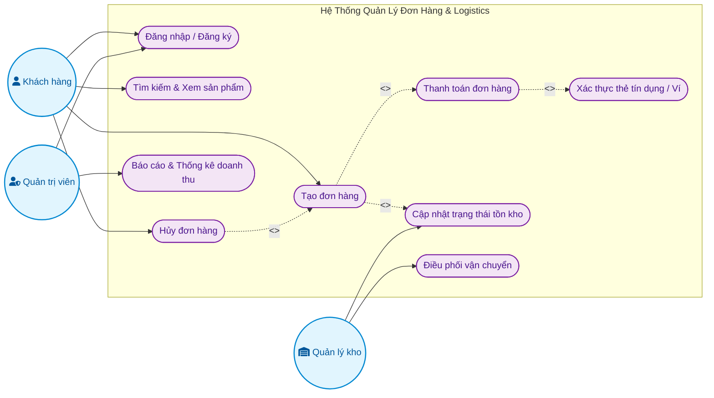
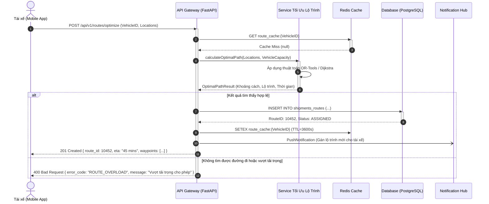
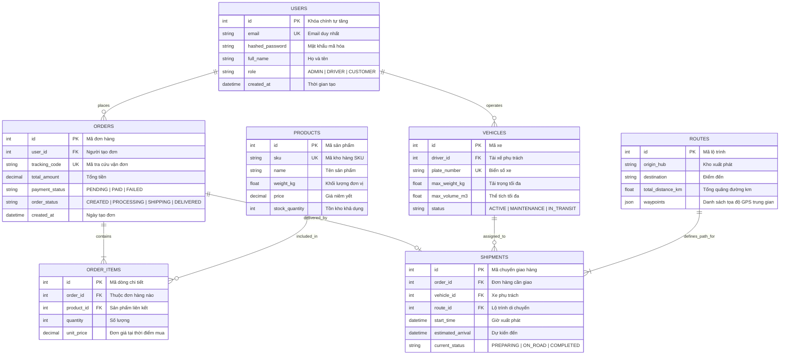
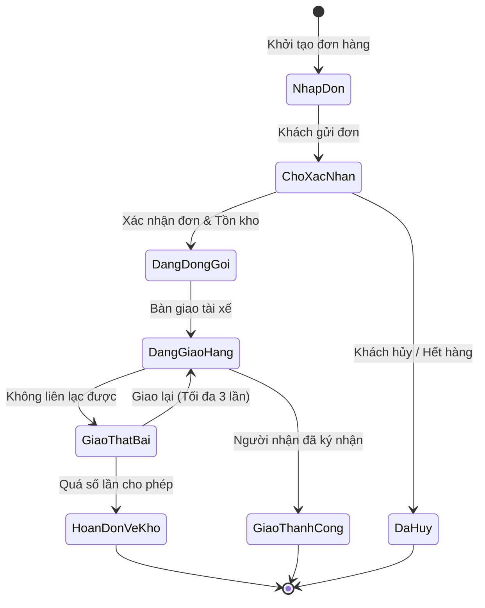
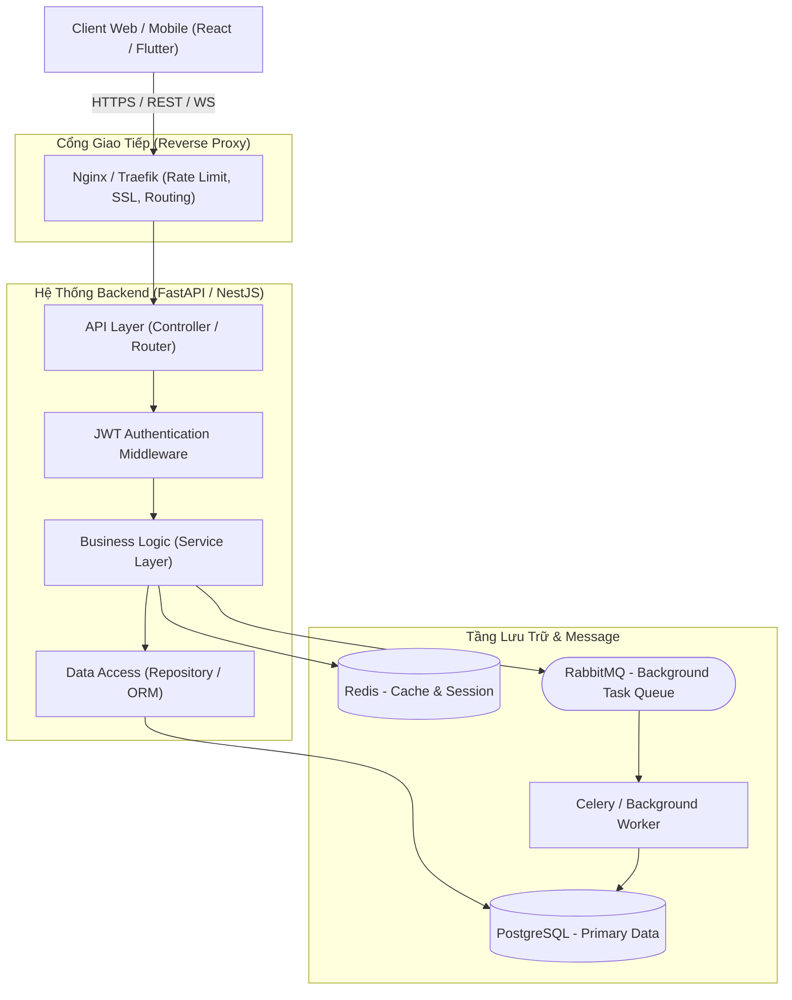

# Skill: Diagram Architect (Mermaid.js Specialist)

## 1. Giới thiệu & Vai trò

`diagram-architect` là một kỹ năng chuyên biệt giúp thiết kế, biểu diễn và chuẩn hóa các mô hình kiến trúc phần mềm, quy trình nghiệp vụ và cấu trúc dữ liệu dưới dạng sơ đồ trực quan bằng **Mermaid.js**.

### Mục tiêu cốt lõi:
- Chuyển đổi mô tả nghiệp vụ thành sơ đồ trực quan, dễ hiểu cho cả kỹ sư và các bên liên quan (stakeholders).
- Đảm bảo 100% cú pháp Mermaid.js hợp lệ, không gây lỗi render trên GitHub, GitLab, Notion, Antigravity và Markdown viewers.
- Tạo cấu trúc sơ đồ sạch sẽ, có phân tầng, chú thích rõ ràng, hỗ trợ tài liệu hóa hệ thống theo tiêu chuẩn kỹ thuật chuyên nghiệp.

---

## 2. Các nguyên tắc vàng khi viết Mermaid.js

1. **Bọc nhãn chứa ký tự đặc biệt**:
   - Nếu nhãn node chứa dấu ngoặc `()`, `[]`, `{}` hoặc ký tự đặc biệt, toán tử, khoảng trắng đặc thù, **bắt buộc** phải bọc trong dấu ngoặc kép:
     ```mermaid
     id1["Người dùng (Khách vãng lai)"]
     id2["Hàm calculateTotal(items)"]
     ```
2. **Không dùng thẻ HTML không an toàn**:
   - Tránh dùng `<br>`, `<b>` nếu không thực sự cần thiết. Dùng chuỗi ký tự chuẩn hoặc dấu ngắt dòng `\n` khi cú pháp hỗ trợ.
3. **Định danh Node ngắn gọn, ngữ nghĩa**:
   - Tách biệt `Node ID` và `Node Label`:
     - Tốt: `auth_service["Dịch vụ Xác thực"]`
     - Không tốt: `Dịch vụ Xác thực["Dịch vụ Xác thực"]`
4. **Lựa chọn hướng hiển thị (Orientation)**:
   - `TB` (Top to Bottom) / `TD` (Top Down): Phù hợp cho sơ đồ phân cấp, kiến trúc tầng, sơ đồ quyết định.
   - `LR` (Left to Right): Phù hợp cho luồng xử lý theo thời gian, pipeline dữ liệu, User Journey.

---

## 3. Thiết kế Sơ đồ Use Case (Use Case Diagram)

Trong Mermaid.js, sơ đồ Use Case thường được biểu diễn tối ưu nhất bằng cú pháp `flowchart LR` kết hợp các hình khối (shapes) và nhóm hệ thống (`subgraph`) để mô phỏng ranh giới hệ thống (System Boundary).

### Quy ước biểu diễn:
- **Actor**: Thường ký hiệu bằng hình lục giác `{{...}}`, hình tròn `((...))` hoặc gắn icon `fa:fa-user`.
- **System Boundary**: Đóng gói trong `subgraph "Tên Hệ Thống" ... end`.
- **Use Case**: Biểu diễn bằng hình Oval `([Tên Use Case])`.
- **Quan hệ**:
  - Tương tác trực tiếp: `-->`
  - Quan hệ phụ thuộc `<<include>>`: `-.->|<<include>>|`
  - Quan hệ mở rộng `<<extend>>`: `-.->|<<extend>>|`
  - Quan hệ kế thừa Actor: `==>|Generalizes|`

### Mẫu sơ đồ Use Case chuẩn:



---

## 4. Thiết kế Sơ đồ Tuần tự (Sequence Diagram)

Sơ đồ tuần tự mô tả sự tương tác giữa các đối tượng theo thứ tự thời gian. Rất quan trọng khi thiết kế API, vi dịch vụ (microservices), và các luồng xử lý giao dịch.

### Cú pháp & Kỹ thuật trọng tâm:
- `autonumber`: Tự động đánh số bước gọi (khuyên dùng cho tài liệu kỹ thuật).
- `actor` vs `participant`: Khai báo rõ vai trò người dùng và thành phần hệ thống.
- Các loại mũi tên:
  - `->>`: Lời gọi đồng bộ (Sync Request).
  - `-->>`: Phản hồi kết quả (Sync Response).
  - `-)`: Lời gọi bất đồng bộ / Message Queue (Async Request).
  - `-->>)`: Phản hồi bất đồng bộ.
- `activate` / `deactivate`: Thể hiện vòng đời xử lý của thành phần.
- Khối điều khiển:
  - `alt / else`: Điều kiện rẽ nhánh (if/else).
  - `opt`: Tùy chọn có hoặc không (optional).
  - `loop`: Vòng lặp.
  - `par`: Xử lý song song đồng thời.
  - `critical`: Giao dịch cần đảm bảo tính toàn vẹn (atomic transaction).

### Mẫu sơ đồ Sequence chuẩn:



---

## 5. Thiết kế Sơ đồ Thực thể Quan hệ (ERD - Entity Relationship Diagram)

ERD biểu diễn cơ sở dữ liệu quan hệ, các bảng (tables/entities), khóa chính (PK), khóa ngoại (FK), các trường dữ liệu và ràng buộc liên kết.

### Bảng Cardinality (Bậc quan hệ):
| Ký hiệu | Ý nghĩa | Ví dụ |
| :--- | :--- | :--- |
| `\|\|--\|\|` | Một - Một bắt buộc (Exactly one) | Người dùng - Hồ sơ CCCD |
| `\|\|--o\|` | Một - Không hoặc Một (Zero or one) | Đơn hàng - Mã giảm giá |
| `\|\|--\|{` | Một - Nhiều bắt buộc (One or more) | Hóa đơn - Dòng chi tiết hóa đơn |
| `\|\|--o{` | Một - Nhiều tùy chọn (Zero or more) | Danh mục - Sản phẩm |
| `}o--o{` | Nhiều - Nhiều (Many to many) | Sinh viên - Môn học |

### Mẫu sơ đồ ERD chuẩn cho Hệ thống Logistics:



---

## 6. Các Sơ đồ Hỗ trợ Phổ biến khác

### A. State Diagram (Vòng đời trạng thái đơn hàng):


### B. Kiến trúc Hệ thống Phân tầng (Architecture Diagram):


---

## 7. Quy trình làm việc đề xuất khi vẽ sơ đồ

Khi người dùng yêu cầu vẽ sơ đồ kiến trúc hoặc thiết kế hệ thống, hãy thực hiện theo 4 bước chuẩn:
1. **Làm rõ yêu cầu & Phạm vi (Scope Clarification)**: Xác định rõ đối tượng mục tiêu, các luồng tương tác và mức độ chi tiết cần hiển thị.
2. **Chọn loại sơ đồ phù hợp**:
   - Nghiệp vụ tổng quan, phân quyền -> **Use Case Diagram**
   - Luồng tương tác giữa các API/Services -> **Sequence Diagram**
   - Thiết kế Database, Bảng, Khóa -> **ERD**
   - Vòng đời dữ liệu (Đơn hàng, Vé, Task) -> **State Diagram**
   - Kiến trúc tổng thể hạ tầng, vi dịch vụ -> **Architecture Flowchart**
3. **Viết mã Mermaid.js chuẩn chỉnh**: Đảm bảo node id sạch sẽ, các nhãn có ngoặc kép, định dạng rõ ràng.
4. **Cung cấp phần giải thích tóm tắt**: Chỉ rõ các điểm nổi bật của sơ đồ (Entity chính, điểm rẽ nhánh rủi ro, cơ chế fallback, transaction).
