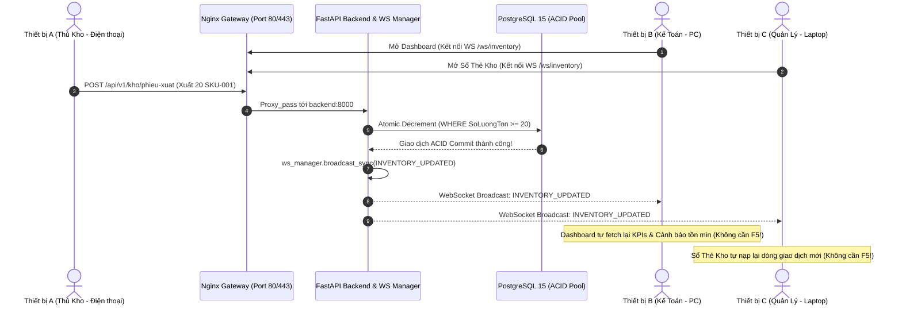

# SmartLogis AI - Hệ Thống Quản Lý Kho Thông Minh Tích Hợp AI

<div align="center">


-success?style=for-the-badge&logo=pytest&logoColor=white)

**Giải pháp Quản lý Kho Vận Vật Tư & Công Trình Xây Dựng kết hợp Giao dịch ACID Chống Tồn Âm và Trợ lý Trí Tuệ Nhân Tạo Google Gemini**

[Tính Năng](#1-tính-năng-nổi-bật) • [Kiến Trúc](#2-kiến-trúc-hệ-thống) • [Cài Đặt](#3-hướng-dẫn-cài-đặt--khởi-chạy) • [Tài Khoản Demo](#4-tài-khoản-demo--phân-quyền) • [Kịch Bản Demo 5 Phút](#5-kịch-bản-demo-5-phút-cho-hội-đồng) • [Kiểm Thử](#6-kiểm-thử-tự-động)

</div>

---

## 1. Tính Năng Nổi Bật

### 1.1. Nghiệp Vụ Kho & Giao Dịch ACID (Zero Negative Stock)
- **Kiểm soát Tồn kho Chống Âm 2 Tầng (Hardware & Software):**
  - **Tầng Backend:** Ứng dụng giải thuật **Atomic SQL Decrement** (`UPDATE ton_kho SET SoLuongTon = SoLuongTon - :qty WHERE SoLuongTon >= :qty`) loại bỏ 100% rủi ro Race Condition / Lost Update khi nhiều thủ kho cùng xuất hàng đồng thời.
  - **Tầng CSDL:** Ràng buộc `CHECK (SoLuongTon >= 0)` kết hợp SQLite Triggers chống can thiệp trực tiếp vào CSDL.
- **Quy trình Nhập - Xuất kho chuẩn mực:**
  - Tự động ghi nhận Master-Detail chứng từ, cập nhật số dư khả dụng và ghi sổ **Thẻ kho (TheKho)** trong cùng 1 Transaction nguyên tử (ACID).
- **Phân quyền RBAC chuẩn hóa 3 vai trò:** **Admin (Quản trị viên)**, **Thủ kho kiêm Kế toán (Thukho)**, và **Nhân viên kho (Employee / Staff - Nhanvien)**. Phân định rõ ràng quyền hạn: Admin toàn quyền quản trị hệ thống, Thủ kho điều hành xuất/nhập ACID & xuất báo cáo kế toán Excel, Nhân viên kho được cấp quyền cơ bản để tra cứu danh mục, kiểm tra tồn khả dụng và xem thẻ kho phục vụ công tác bốc dỡ/kiểm đếm.

### 1.2. Trợ Lý AI Điều Hành Kho (Google Gemini LLM)
- **Module Data Sanitizer (Khử Nhạy Cảm 100%):** Tự động loại bỏ hoàn toàn các thông tin giá vốn bí mật (`DonGiaNhap`, `ThanhTien`, `GiaVon`) trước khi gửi context cho AI.
- **Prompt Engineering Chống Ảo Giác (Anti-hallucination):** System Instruction nghiêm ngặt ràng buộc AI chỉ phân tích dựa trên dữ liệu JSON thực tế, tuyệt đối không bịa số liệu.
- **Báo cáo Điều hành Chuẩn 3 Phần:**
  1. *Phần 1:* Tình trạng tồn kho tổng quan.
  2. *Phần 2:* Cảnh báo & Đề xuất nhập hàng khẩn cấp (dựa trên mức tồn min và tốc độ tiêu thụ Burn-rate).
  3. *Phần 3:* Tóm tắt biến động bất thường (SKU xuất đột biến & hàng tồn đọng > 60 ngày - Dead stock).
- **Cơ Chế Local Grounded Fallback Engine:** Tự động chuyển đổi sang giải thuật phân tích CSDL nội bộ khi mất mạng hoặc quá hạn ngạch (429 Rate Limit), đảm bảo hệ thống luôn sẵn sàng 24/7.

---

## 2. Kiến Trúc Hệ Thống

### 2.1. Sơ Đồ Xử Lý Dữ Liệu & AI Grounded Insights

```mermaid
flowchart TD
    subgraph Core_WMS [Tầng Nghiệp Vụ Kho WMS]
        DB[(CSDL SQLite / PostgreSQL)] -->|Truy vấn 30 ngày| Aggregator[Inventory Data Aggregator]
        Aggregator -->|Dữ liệu thô| Sanitizer[Data Sanitizer Filter]
        Sanitizer -->|Loại bỏ DonGiaNhap| CleanJSON[Sanitized Context JSON]
    end

    subgraph AI_Engine [Tầng Trí Tuệ Nhân Tạo]
        CleanJSON --> PromptBuilder[Prompt Engineering Engine]
        SysPrompt[System Prompt Anti-Hallucination] --> PromptBuilder
        PromptBuilder --> GeminiService[Gemini API Client]
        GeminiService -->|Call REST API / Retry| LiveAPI{Google Gemini API}
        LiveAPI -->|200 OK| Parser[Response Parser]
        LiveAPI -->|429 / Timeout| Fallback[Local Grounded Fallback Engine]
        Fallback --> Parser
    end

    subgraph Web_UI [Giao Diện Người Dùng]
        Parser --> APIEndpoint[/api/v1/ai/generate-report]
        APIEndpoint --> Widget[Dashboard Live Widget]
        APIEndpoint --> Modal[Modal Báo Cáo 3 Phần]
    end
```

### 2.2. Cấu Trúc Thư Mục Dự Án

```text
smartlogis-ai/
├── app/
│   ├── api/v1/                 # Các REST API Routers
│   │   ├── auth_router.py      # Đăng ký, đăng nhập JWT, phân quyền
│   │   ├── inventory_router.py # APIs Danh mục, Nhập/Xuất kho ACID, Thẻ kho
│   │   ├── reports_router.py   # APIs báo cáo và xuất Excel
│   │   └── ai_router.py        # APIs Trợ lý AI (/advisory, /generate-report, /raw-context)
│   ├── core/                   # Cấu hình hạt nhân (Config, Database, Security)
│   ├── models/                 # SQLAlchemy ORM Models (CheckConstraint, Indexes, Triggers)
│   ├── schemas/                # Pydantic Schemas & DTOs
│   ├── services/               # Tầng nghiệp vụ xử lý Transaction & AI
│   │   ├── inbound_service.py  # Transaction nhập kho ACID
│   │   ├── outbound_service.py # Atomic Decrement chống Race Condition
│   │   ├── ai_data_service.py  # Data Aggregator 30 ngày & Data Sanitizer
│   │   └── gemini_service.py   # Kết nối Gemini API, Retry & Fallback Engine
│   ├── prompts/                # Prompt Templates chống ảo giác & cấu trúc 3 phần
│   └── templates/              # Giao diện người dùng Jinja2 + Tailwind CSS
├── docs/                       # Toàn bộ tài liệu báo cáo kỹ thuật & Slide bảo vệ
├── scripts/                    # Scripts nạp dữ liệu mẫu và migration
│   ├── seed_data.py            # Seeder dữ liệu chuẩn 20 SKUs kèm cờ --reset
│   └── migrate_v2_constraints_indexes.py # Migration SQLite Indexes & Triggers
├── tests/                      # Bộ kiểm thử tự động 12 test cases (100% Passed)
│   ├── test_ai_engine.py       # Kiểm thử AI Engine, Mocking & Khử giá nhập
│   └── test_phase2_inventory.py# Kiểm thử ACID, Concurrency Race Condition, RBAC
├── Dockerfile                  # Docker container build (Python 3.12-slim)
├── docker-compose.yml          # Triển khai đồng thời Backend & PostgreSQL
├── run_app.bat                 # Script khởi chạy nhanh 1-click cho Windows
├── start.sh                    # Script khởi chạy nhanh cho Linux/macOS
├── requirements.txt            # Danh sách thư viện Python
└── README.md                   # Tài liệu hướng dẫn sử dụng
```

---

---

## 3. Hướng Dẫn Triển Khai & Truy Cập Đa Thiết Bị (Production Web Server)

Hệ thống **SmartLogis AI** được thiết kế chuẩn hạ tầng Web Server Doanh nghiệp: **Nginx Reverse Proxy làm cổng vào duy nhất (Port 80 & 443)**, phân luồng lưu lượng tới cụm container `frontend` và `backend`, kết nối CSDL tập trung `database` (PostgreSQL 15), hỗ trợ truy cập đồng thời từ PC máy chủ, điện thoại di động, máy tính bảng trong cùng mạng LAN/Wi-Fi hoặc qua tên miền sản xuất `smartlogis-ai.com`.

---

### 3.1. Khởi Chạy 1-Click Tự Động (1-Click Run Server)

#### A. Trên Windows:
Nhấp đúp chuột vào file:
```cmd
run_server.bat
```
*Script tự động dò địa chỉ IP LAN thật của máy tính, khởi chạy toàn bộ 4 Containers qua Docker Compose và in bảng điều hướng truy cập trực quan:*

```text
===============================================================================
           SMARTLOGIS AI - HE THONG QUAN LY KHO THONG MINH
         PRODUCTION WEB SERVER & MULTI-DEVICE GATEWAY RUNNER
===============================================================================
[OK] Dia chi IP LAN may chu: 192.168.11.174

===============================================================================
                     BANG HUONG DAN TRUY CAP HE THONG
===============================================================================
 1. TRUY CAP TU MAY CHU (Localhost):
    * Web App (HTTP):       http://localhost
    * Web App (HTTPS SSL):  https://localhost

 2. TRUY CAP TU DIEN THOAI / TABLET (CUNG WI-FI / LAN):
    * Dia chi Web:          http://192.168.11.174
    * WebSocket Stream:     ws://192.168.11.174/ws/inventory

 3. TRUY CAP QUA TEN MIEN SAN XUAT:
    * HTTP:                 http://smartlogis-ai.com
    * HTTPS (Bao mat SSL):  https://smartlogis-ai.com

 4. CONG CU QUAN TRI & TAI LIEU KY THUAT:
    * Quan tri CSDL:       http://localhost:5050 (pgAdmin 4)
    * Tai lieu API Docs:   http://localhost/docs  hoac  http://192.168.11.174/docs
===============================================================================
```

#### B. Trên Linux / macOS:
```bash
chmod +x run_server.sh
./run_server.sh
```

---

### 3.2. Hướng Dẫn Kết Nối Từ Điện Thoại & Máy Tính Bảng (Cùng Wi-Fi/LAN)

1. **Bước 1 - Kết nối mạng:** Kết nối điện thoại di động / máy tính bảng vào **chung mạng Wi-Fi** với máy chủ chạy SmartLogis AI.
2. **Bước 2 - Lấy địa chỉ IP LAN:** Xem dòng `Dia chi Web: http://<LAN_IP>` trên màn hình terminal máy chủ (Ví dụ: `http://192.168.11.174`).
3. **Bước 3 - Mở trình duyệt:** 
   - Trên điện thoại, mở trình duyệt (Safari trên iPhone/iPad hoặc Chrome trên Android).
   - Nhập thẳng địa chỉ IP: `http://192.168.11.174` (không cần gõ cổng `:8000` vì Nginx đã lắng nghe tại Port 80 tiêu chuẩn).
4. **Bước 4 - Đăng nhập:** Chọn tài khoản Quản trị viên (`admin` / `admin123`) hoặc Thủ kho kiêm Kế toán (`thukho` / `thukho123`).

---

### 3.3. Hướng Dẫn Cấu Hình Tên Miền Ảo `smartlogis-ai.com` Qua File `hosts`

Để truy cập hệ thống bằng tên miền doanh nghiệp `smartlogis-ai.com` thay vì địa chỉ IP:

#### Trên Windows:
- **Cách nhanh:** Chạy file `setup_domain_local.bat` dưới quyền Administrator (Run as Administrator).
- **Cách thủ công:**
  1. Mở `Notepad` hoặc `VS Code` bằng quyền **Administrator**.
  2. Mở file: `C:\Windows\System32\drivers\etc\hosts`.
  3. Thêm các dòng sau vào cuối file:
     ```text
     127.0.0.1       smartlogis-ai.com
     127.0.0.1       www.smartlogis-ai.com
     ```
     *(Nếu cấu hình trên máy khách/laptop khác trong mạng LAN, thay `127.0.0.1` bằng địa chỉ IP LAN của máy chủ, ví dụ: `192.168.11.174 smartlogis-ai.com`)*
  4. Lưu file. Mở trình duyệt truy cập `http://smartlogis-ai.com` hoặc `https://smartlogis-ai.com`.

#### Trên macOS / Linux:
```bash
sudo nano /etc/hosts
```
Thêm dòng:
```text
127.0.0.1       smartlogis-ai.com www.smartlogis-ai.com
```
Lưu file (`Ctrl + O`, `Enter`, `Ctrl + X`).

---

### 3.4. Cơ Chế Đồng Bộ CSDL Tập Trung & Realtime Multi-Device Sync

Hệ thống giải quyết triệt để bài toán đồng bộ dữ liệu thời gian thực giữa nhiều phòng ban:



- **Mọi thao tác Nhập/Xuất kho** từ thiết bị A lập tức ghi nhận vào CSDL PostgreSQL tập trung.
- **Server tự động Broadcast sự kiện `INVENTORY_UPDATED`** tới toàn bộ thiết bị đang trực tuyến.
- **Giao diện Client tự động làm mới số liệu:**
  - 4 thẻ KPI Dashboard và Bảng Cảnh Báo Tồn Min cập nhật ngay tức thì.
  - Màn hình Tra cứu Thẻ kho tự động chèn thêm dòng biến động số dư lũy kế.
  - Màn hình Lập Phiếu Xuất Kho tự động làm mới tồn khả dụng để ngăn chặn kịp thời hành vi xuất vượt tồn (Zero Negative Stock).

---

### 3.5. Cấu Hình Tường Lửa (Firewall Troubleshooting)

Nếu điện thoại hoặc máy tính khác trong mạng Wi-Fi không thể kết nối tới máy chủ, nguyên nhân thường do Windows Defender Firewall hoặc Linux UFW chặn cổng:

#### Trên Windows:
- Chạy file `open_firewall.bat` bằng quyền **Administrator**.
- Hoặc mở PowerShell (Run as Administrator) và chạy:
  ```powershell
  New-NetFirewallRule -DisplayName "SmartLogis Web Server (Port 80, 443, 8000)" -Direction Inbound -LocalPort 80,443,8000 -Protocol TCP -Action Allow
  ```

#### Trên Linux:
```bash
sudo ufw allow 80/tcp
sudo ufw allow 443/tcp
sudo ufw reload
```

---


## 4. Tài Khoản Demo & Phân Quyền

Hệ thống đã tích hợp các nút đăng nhập 1-click ngay tại màn hình Login:

| Tên Đăng Nhập | Mật Khẩu | Vai Trò | Phạm Vi Quyền Hạn |
| :--- | :--- | :--- | :--- |
| **`admin`** | `admin123` | **Quản Trị Viên** | Toàn quyền quản trị hệ thống: Phân quyền, cấu hình kho, quản lý danh mục, lập chứng từ, xuất Excel, xem báo cáo AI |
| **`thukho`** | `thukho123` | **Thủ Kho Kiêm Kế Toán** | Vận hành kho toàn diện & đối soát tài chính: Quản lý danh mục hàng hóa & NCC, lập phiếu nhập/xuất ACID, tra cứu thẻ kho, xuất báo cáo kế toán Excel |
| **`nhanvien`** | `nhanvien123` | **Nhân Viên Kho (Staff)** | Quyền hạn cơ bản (Chỉ đọc): Xem Dashboard, tra cứu danh mục SKU, tra cứu nhà cung cấp, xem sổ thẻ kho biến động; Không có quyền lập phiếu nhập/xuất, không xuất Excel, không thay đổi Master Data |

---

## 5. Kịch Bản Demo 5 Phút Cho Hội Đồng

### Phút 1: Đăng Nhập & Tổng Quan Dashboard
- Truy cập `http://127.0.0.1:8000/login`, bấm nút **"Đăng nhập nhanh Thủ kho"**.
- Quan sát **Dashboard v2.0**:
  - 4 Thẻ KPIs: Tổng mặt hàng (`20 SKU`), Cảnh báo tồn min (`7 SKU`), Tổng giao dịch nhập/xuất 30 ngày.
  - Khối **Cảnh Báo Tồn Min**: Hiển thị bảng mã hàng đỏ (nguy cấp) và vàng (cận ngưỡng).

### Phút 2: Trải Nghiệm AI Gemini Advisory & Báo Cáo 3 Phần
- Tại khối **SmartLogis AI Widget**, quan sát badge `Gemini Live` màu xanh lá.
- Bấm nút **"Báo cáo 3 phần"**:
  - Modal thông minh mở ra hiển thị chuẩn xác:
    - *Phần 1:* Tình trạng tồn kho tổng quan.
    - *Phần 2:* Đề xuất nhập thêm Thép Cuộn D10 (+46 cuộn), Xi Măng Bút Sơn (+85 bao) dựa trên Burn-rate.
    - *Phần 3:* Phát hiện hàng ứ đọng > 60 ngày (Sơn Epoxy KCC đọng 45 thùng, Bu lông neo đọng 120 bộ).
- Bấm nút **"Phân tích lại"** để xem spinner loading và phản hồi trực tiếp từ Google Gemini API.

### Phút 3: Thử Nghiệm Chống Tồn Âm & Race Condition (ACID Protection)
- Vào menu **Xuất kho** (`/outbound`).
- Chọn mặt hàng `[HH-THEP-D10] Thép cuộn phi 10` (Tồn hiện tại chỉ còn `4 cuộn`).
- Cố tình nhập số lượng xuất là `20 cuộn` (Vượt mức khả dụng 16 cuộn):
  - **Tầng UI:** Giao diện lập tức viền đỏ rực, hiển thị badge lỗi âm tồn `-16`, banner cảnh báo và **vô hiệu hóa nút xác nhận**.
  - **Tầng Backend:** Kể cả khi bypass UI gửi request qua Postman/API, Atomic Decrement lập tức rollback giao dịch và trả về `400 Bad Request`. Không bao giờ có chuyện tồn âm!

### Phút 4: Lập Phiếu Nhập Kho & Đối Soát Thẻ Kho
- Vào menu **Nhập kho** (`/inbound`).
- Lập phiếu nhập 50 cuộn `HH-THEP-D10` từ nhà cung cấp Hòa Phát.
- Bấm xác nhận -> Giao dịch thành công, tồn kho lập tức tăng lên `54 cuộn`.
- Vào menu **Tra Cứu Thẻ Kho** (`/the-kho`):
  - Chọn mã `HH-THEP-D10` -> Xem lịch sử giao dịch tăng giảm và tồn lũy kế chính xác 100%.

### Phút 5: Kiểm Toán Dữ Liệu Khử Nhạy Cảm (Data Sanitizer)
- Mở Swagger API tại `/docs`.
- Gọi endpoint `GET /api/v1/ai/raw-context`:
  - Quan sát toàn bộ JSON context nạp cho AI: **Tuyệt đối không chứa bất kỳ trường đơn giá nhập hay giá vốn nào**, bảo vệ bí mật kinh doanh tuyệt đối.

---

## 6. Kiểm Thử Tự Động

Toàn bộ hệ thống được bảo vệ bởi bộ kiểm thử tự động với 16 test cases bao phủ toàn bộ các tầng ứng dụng (AI Engine, CRUD, ACID, Race Condition, RBAC 3 vai trò, và Realtime WebSocket):

```powershell
py -3.12 -m pytest tests/ -v
```

**Kết quả ghi nhận (100% Passed):**
```text
tests/test_ai_engine.py::test_ai_data_empty_inventory PASSED             [  6%]
tests/test_ai_engine.py::test_ai_under_min_stock_recommendation PASSED   [ 12%]
tests/test_ai_engine.py::test_mocking_gemini_api_call PASSED             [ 18%]
tests/test_ai_engine.py::test_ai_api_endpoints_integration PASSED        [ 25%]
tests/test_crud.py::test_crud_suite PASSED                               [ 31%]
tests/test_endpoints.py::test_endpoints_suite PASSED                     [ 37%]
tests/test_phase2_inventory.py::test_inbound_acid_transaction PASSED     [ 43%]
tests/test_phase2_inventory.py::test_outbound_negative_stock_prevention PASSED [ 50%]
tests/test_phase2_inventory.py::test_outbound_concurrency_race_condition PASSED [ 56%]
tests/test_phase2_inventory.py::test_rbac_matrix PASSED                  [ 62%]
tests/test_phase2_inventory.py::test_employee_role_restrictions PASSED   [ 68%]
tests/test_phase2_inventory.py::test_database_level_negative_stock_constraints PASSED [ 75%]
tests/test_supplier_crud.py::test_supplier_suite PASSED                  [ 81%]
tests/test_websocket.py::test_websocket_connect_and_ping PASSED          [ 87%]
tests/test_websocket.py::test_websocket_broadcast_event PASSED           [ 93%]
tests/test_websocket.py::test_inbound_api_triggers_realtime_broadcast PASSED [100%]

====================== 16 passed in 34.09s =======================
```

---

## 7. Tài Liệu Nghiệm Thu & Bàn Giao Chính Thức

- [Báo Cáo Đồ Án Chính Thức (Word docx)](file:///docs/HTD_NTH_KTPMK23A.docx)
- [Slide Thuyết Trình Bảo Vệ Đồ Án (PowerPoint pptx)](file:///docs/SmartLogis_AI_Presentation_Deck.pptx)
- [Đặc Tả Thiết Kế Cơ Sở Dữ Liệu 11 Bảng (MySQL 8.0 & SQLite)](file:///docs/database_design.md)
- [Hướng Dẫn Triển Khai Web Server, Nginx SSL & Tên Miền](file:///docs/DEPLOY_DOMAIN_GUIDE.md)
- [Thư Mục 15 Sơ Đồ Kỹ Thuật Chuẩn Hóa 300 DPI](file:///docs/generated_diagrams/)

---

<div align="center">
  <b>SmartLogis AI © 2026 - Phát triển và hoàn thiện bởi Đội ngũ Kỹ sư Công nghệ</b>
</div>