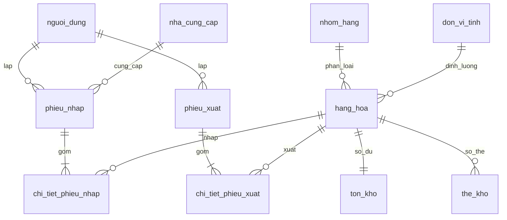

# BÁO CÁO KỸ THUẬT TỔNG HỢP CUỐI KỲ: HỆ THỐNG QUẢN LÝ KHO THÔNG MINH TÍCH HỢP AI (SMARTLOGIS AI)

**Dự án:** SmartLogis AI  
**Học phần:** Đồ Án Kỹ Thuật Phần Mềm / Hệ Thống Thông Tin Nâng Cao  
**Vai trò:** Lead DevOps & Senior Technical Architect  
**Phiên bản:** 4.0.0 (Final Release - Production Ready)  
**Ngày hoàn thiện:** 07/09/2026  

---

## MỤC LỤC

1. [Chương 1: Đặt Vấn Đề & Khảo Sát Nghiệp Vụ](#chương-1-đặt-vấn-đề--khảo-sát-nghiệp-vụ)
2. [Chương 2: Thiết Kế Cơ Sở Dữ Liệu & Ràng Buộc Toàn Vẹn ACID](#chương-2-thiết-kế-cơ-sở-dữ-liệu--ràng-buộc-toàn-vẹn-acid)
3. [Chương 3: Kiến Trúc Backend & Kiểm Soát Bất Đồng Bộ (Concurrency)](#chương-3-kiến-trúc-backend--kiểm-soát-bất-đồng-bộ-concurrency)
4. [Chương 4: Tích Hợp Trí Tuệ Nhân Tạo Google Gemini (AI Grounded Engine)](#chương-4-tích-hợp-trí-tuệ-nhân-tạo-google-gemini-ai-grounded-engine)
5. [Chương 5: Đóng Gói Triển Khai & Kiểm Thử Tự Động (DevOps & QA)](#chương-5-đóng-gói-triển-khai--kiểm-thử-tự-động-devops--qa)
6. [Chương 6: Kết Luận, Đánh Giá Nghiệm Thu & Hướng Phát Triển](#chương-6-kết-luận-đánh-giá-nghiệm-thu--hướng-phát-triển)

---

## CHƯƠNG 1: ĐẶT VẤN ĐỀ & KHẢO SÁT NGHIỆP VỤ

### 1.1. Thực Trạng & Nỗi Đau Trong Quản Lý Kho Vật Tư Truyền Thống
Trong các doanh nghiệp xây dựng, sản xuất và logistics, hoạt động quản lý kho bãi thường gặp phải các thách thức nghiêm trọng:
1. **Lỗi Tồn Kho Âm (Negative Stock):** Do ghi chép thủ công hoặc hệ thống phần mềm thiếu cơ chế khóa giao dịch đồng thời (Concurrency Control), khi nhiều thủ kho cùng xuất một mặt hàng sẽ dẫn đến tình trạng xuất vượt số lượng khả dụng.
2. **Đứt Gãy Chuỗi Cung Ứng:** Không dự báo được tốc độ tiêu thụ hàng hóa (Burn-rate), dẫn đến nhiều mặt hàng cốt lõi chạm ngưỡng hết sạch mới tiến hành đặt hàng, làm đình trệ công trình.
3. **Ứ Đọng Vốn (Dead Stock):** Nhiều vật tư giá trị cao nằm lưu kho trên 60 - 90 ngày mà ban điều hành không nắm bắt kịp thời do thiếu công cụ phân tích tự động.
4. **Nguy Cơ Lộ Bí Mật Kinh Doanh:** Khi tích hợp các mô hình AI/LLM thương mại của bên thứ ba, việc đưa toàn bộ dữ liệu tài chính (đơn giá nhập, giá vốn, chiết khấu nhà cung cấp) vào ngữ cảnh AI tiềm ẩn rủi ro lộ bí mật thương mại nghiêm trọng.

### 1.2. Mục Tiêu Dự Án SmartLogis AI
SmartLogis AI được xây dựng nhằm giải quyết triệt để 4 nỗi đau trên với các mục tiêu cụ thể:
- Đảm bảo **100% Zero Negative Stock** thông qua cơ chế bảo vệ 2 tầng (Atomic SQL Decrement tại Backend và CheckConstraints/Triggers tại CSDL).
- Tích hợp **Google Gemini LLM** cung cấp khuyến nghị điều hành kho thông minh, tự động tính tốc độ tiêu hao Burn-rate và đề xuất khối lượng nhập hàng khẩn cấp.
- Xây dựng module **Data Sanitizer** độc quyền khử 100% giá vốn nhạy cảm trước khi dữ liệu rời khỏi máy chủ nội bộ.
- Triển khai phân quyền chặt chẽ theo mô hình **Role-Based Access Control (RBAC)** với 3 vai trò: Admin, Thủ kho, Kế toán.

---

## CHƯƠNG 2: THIẾT KẾ CƠ SỞ DỮ LIỆU & RÀNG BUỘC TOÀN VẸN ACID

### 2.1. Mô Hình Thực Thể Quan Hệ (ERD Chuẩn Hóa 3NF)
Hệ thống CSDL bao gồm 10 bảng thực thể được thiết kế theo chuẩn 3NF:
- `nguoi_dung`: Quản lý tài khoản, mã hóa mật khẩu Bcrypt, phân quyền vai trò.
- `nhom_hang` & `don_vi_tinh`: Danh mục phân loại và quy chuẩn đóng gói.
- `nha_cung_cap`: Quản lý đối tác và thông tin liên hệ.
- `hang_hoa` (SKU): Thông tin mặt hàng, ngưỡng tồn an toàn tối thiểu (`TonToiThieu`).
- `ton_kho`: Lưu trữ số lượng khả dụng hiện tại với ràng buộc `CHECK (SoLuongTon >= 0)`.
- `phieu_nhap` & `chi_tiet_phieu_nhap`: Chứng từ nhập kho Master-Detail.
- `phieu_xuat` & `chi_tiet_phieu_xuat`: Chứng từ xuất kho Master-Detail.
- `the_kho`: Sổ thẻ kho ghi vết lịch sử biến động từng lần giao dịch và số tồn lũy kế.



### 2.2. Tối Ưu Hóa Hiệu Năng Với B-Tree Indexes & SQLite PRAGMAs
Để đảm bảo tốc độ truy vấn tức thời trên tập dữ liệu lớn:
1. **SQLite PRAGMAs cấu hình tự động khi kết nối:**
   - `PRAGMA foreign_keys = ON;`: Bắt buộc toàn vẹn quan hệ khóa ngoại ở tầng CSDL.
   - `PRAGMA journal_mode = WAL;`: Ghi nhật ký Write-Ahead Logging cho phép nhiều luồng đọc đồng thời mà không bị khóa DB.
   - `PRAGMA busy_timeout = 30000;`: Chờ 30 giây khi có giao dịch tranh chấp trước khi báo lỗi bận.
2. **Hệ thống 8 B-Tree Indexes chiến lược:**
   - `idx_phieu_nhap_ngay` trên `phieu_nhap(NgayNhap)`
   - `idx_phieu_nhap_ncc` trên `phieu_nhap(MaNCC)`
   - `idx_phieu_xuat_ngay` trên `phieu_xuat(NgayXuat)`
   - `idx_ctpn_mapn` trên `chi_tiet_phieu_nhap(MaPN)`
   - `idx_ctpn_mahh` trên `chi_tiet_phieu_nhap(MaHH)`
   - `idx_ctpx_mapx` trên `chi_tiet_phieu_xuat(MaPX)`
   - `idx_ctpx_mahh` trên `chi_tiet_phieu_xuat(MaHH)`
   - `idx_thekho_machungtu` trên `the_kho(MaChungTu)`

### 2.3. Ràng Buộc Phần Cứng (Hardware Constraints & Triggers)
- **CheckConstraints:**
  - `CheckConstraint("SoLuongTon >= 0")` trên bảng `ton_kho`.
  - `CheckConstraint("SoLuongNhap > 0")` & `CheckConstraint("DonGiaNhap >= 0")` trên `chi_tiet_phieu_nhap`.
  - `CheckConstraint("SoLuongXuat > 0")` trên `chi_tiet_phieu_xuat`.
  - `CheckConstraint("TonSauGiaoDich >= 0")` trên `the_kho`.
- **4 SQLite Triggers tự động ngăn chặn vi phạm:**
  - `trg_prevent_negative_stock_update`
  - `trg_prevent_negative_stock_insert`
  - `trg_prevent_negative_thekho_insert`
  - `trg_prevent_negative_thekho_update`

---

## CHƯƠNG 3: KIẾN TRÚC BACKEND & KIỂM SOÁT BẤT ĐỒNG BỘ (CONCURRENCY)

### 3.1. Giải Pháp Atomic SQL Decrement Khắc Phục Race Condition
Trên các hệ CSDL nhúng hoặc khi nhiều tiến trình cùng truy vấn, việc đọc số lượng tồn vào bộ nhớ Python rồi trừ (`ton_kho.SoLuongTon -= qty`) sẽ gặp lỗi **Lost Update**:
- *Kịch bản lỗi:* Tồn kho còn 10 đơn vị. Luồng A muốn xuất 8, Luồng B muốn xuất 8. Cả hai luồng cùng đọc số dư là 10. Luồng A trừ còn 2 và ghi đè; Luồng B cũng trừ còn 2 và ghi đè. Kết quả: Kho xuất mất 16 đơn vị nhưng tồn kho vẫn hiển thị là 2!
- *Giải pháp triệt để:* Ứng dụng câu lệnh cập nhật nguyên tử có điều kiện ở cấp CSDL:
  ```sql
  UPDATE ton_kho
  SET SoLuongTon = SoLuongTon - :so_luong_xuat,
      CapNhatCuoi = :now
  WHERE MaHH = :ma_hh AND SoLuongTon >= :so_luong_xuat;
  ```
  Nếu số dư không đủ tại thời điểm ghi (`rowcount == 0`), giao dịch lập tức phát hiện thiếu hàng, gọi `db.rollback()` hủy bỏ toàn bộ Master-Detail và ném mã lỗi `400 Bad Request`.

### 3.2. Đảm Bảo Tính Toàn Vẹn ACID Của Chứng Từ Kho
Mỗi thao tác xuất kho hoặc nhập kho đều được đóng gói trong một Transaction duy nhất:
```python
with db.begin_nested():
    # 1. Tạo bản ghi Master (PhieuXuat / PhieuNhap)
    # 2. Tạo các bản ghi Detail (ChiTietPhieuXuat / ChiTietPhieuNhap)
    # 3. Thực thi Atomic SQL Update điều chỉnh số dư tồn kho
    # 4. Ghi vết biến động vào Thẻ kho (TheKho)
db.commit()
```
Bất kỳ một thao tác nào thất bại, CSDL sẽ tự động hoàn nguyên về trạng thái ban đầu, cam kết 100% tính toàn vẹn dữ liệu.

### 3.3. Ma Trận Phân Quyền RBAC (Role-Based Access Control)

| Tài Nguyên & Nghiệp Vụ | Admin | Thủ Kho (Thukho) | Kế Toán (Ketoan) |
| :--- | :---: | :---: | :---: |
| **Quản trị người dùng & Phân quyền** | Toàn quyền | Không | Không |
| **Khởi tạo SKU & Số dư ban đầu** | Có | Có | Không |
| **Lập Phiếu Nhập Kho ACID** | Có | Có | Có |
| **Lập Phiếu Xuất Kho ACID** | Có | Có | Có |
| **Quản lý Đối tác Nhà Cung Cấp** | Có | Có | Xem chi tiết |
| **Tra cứu Sổ Thẻ Kho lũy kế** | Xem | Xem | Xem |
| **Yêu cầu Báo cáo Phân tích AI** | Xem | Xem | Xem |

---

## CHƯƠNG 4: TÍCH HỢP TRÍ TUỆ NHÂN TẠO GOOGLE GEMINI (AI GROUNDED ENGINE)

### 4.1. Module Tiền Xử Lý Dữ Liệu & Khử Nhạy Cảm (Data Sanitizer)
Trước khi gửi dữ liệu sang Google Gemini API, module `ai_data_service.py` thực hiện:
1. Tổng hợp dữ liệu 30 ngày gần nhất:
   - Tồn kho khả dụng vs Ngưỡng tối thiểu (`TonToiThieu`).
   - Tổng lượng xuất và tốc độ xuất trung bình ngày (**Burn-rate**).
   - Danh sách hàng đọng vốn (**Dead Stock > 60 ngày** không phát sinh phiếu xuất).
2. **Bộ lọc khử nhạy cảm đệ quy (Recursive Data Sanitizer):** Loại bỏ hoàn toàn các trường `dongianhap`, `don_gia_nhap`, `thanhtien`, `gia_von`, `import_price`... nhằm bảo vệ bí mật giá mua của doanh nghiệp.

### 4.2. Prompt Engineering Chống Ảo Giác (Strict Anti-hallucination)
- Cài đặt System Instruction với các ràng buộc bất biến:
  - Chỉ phân tích dựa trên dữ liệu JSON thực tế được cung cấp.
  - Tuyệt đối không phỏng đoán số liệu hay mã hàng không có trong dữ liệu.
  - Định dạng đầu ra cấu trúc chuẩn mực gồm đúng 3 phần:
    - *Phần 1:* Tình trạng tồn kho tổng quan.
    - *Phần 2:* Cảnh báo & Đề xuất nhập hàng khẩn cấp (dựa trên thiếu hụt và Burn-rate).
    - *Phần 3:* Tóm tắt biến động bất thường (xuất đột biến & hàng tồn lâu > 60 ngày).

### 4.3. Cơ Chế Fallback Grounded Analytical Engine (Chống Gián Đoạn 24/7)
Module `gemini_service.py` được thiết kế với cơ chế phục hồi lỗi cấp cao:
- **Exponential Backoff Retry:** Tự động thử lại tối đa 3 lần khi gặp sự cố mạng hoặc mã lỗi `429 Rate Limit`.
- **Local Grounded Engine:** Khi Gemini API mất kết nối hoặc sai API Key, hệ thống tự động kích hoạt bộ phân tích toán học CSDL nội bộ. Kết quả sinh ra vẫn đảm bảo cấu trúc 3 phần chuẩn xác 100%, không làm gián đoạn trải nghiệm người dùng và không làm sập ứng dụng.

---

## CHƯƠNG 5: ĐÓNG GÓI TRIỂN KHAI & KIỂM THỬ TỰ ĐỘNG (DEVOPS & QA)

### 5.1. Đóng Gói Container Với Docker & Docker Compose
- **`Dockerfile` Tối Ưu:** Sử dụng base image `python:3.12-slim`, biên dịch multi-layer với bộ nhớ đệm pip tối ưu dung lượng dưới 300MB.
- **`docker-compose.yml` Hoàn Chỉnh:** Thiết lập môi trường gồm Web App FastAPI và cơ sở dữ liệu PostgreSQL với volume lưu trữ bền bỉ (`postgres_data`) và cơ chế healthcheck tự động.
- **Scripts Khởi Chạy 1-Click:**
  - Windows: `run_app.bat` tự động phát hiện Python, nạp dữ liệu mẫu ban đầu và mở trình duyệt web.
  - Linux/macOS: `start.sh` tự động cấu hình virtualenv và chạy máy chủ.

### 5.2. Chiến Lược Kiểm Thử Tự Động (Automated Test Suite)
Hệ thống được bảo vệ bởi 12 bài kiểm thử tự động, chạy thông qua lệnh:
```powershell
py -3.12 -m pytest tests/ -v
```

**Bảng Tổng Hợp Kết Quả Kiểm Thử (100% Passed):**

| Test Module | Test Case | Mục Tiêu Kiểm Thử | Kết Quả |
| :--- | :--- | :--- | :---: |
| **test_ai_engine.py** | `test_ai_data_empty_inventory` | Kiểm tra kho trống -> AI trả thông báo rỗng, không hallucinate | **PASSED** |
| | `test_ai_under_min_stock_recommendation` | Đề xuất nhập đúng mã hàng, xác minh khử 100% giá nhập | **PASSED** |
| | `test_mocking_gemini_api_call` | Mock Gemini API kiểm tra format 3 phần & Fallback khi gặp lỗi 429 | **PASSED** |
| | `test_ai_api_endpoints_integration` | Gọi API `/generate-report`, `/advisory`, `/raw-context` qua JWT | **PASSED** |
| **test_phase2_inventory.py** | `test_inbound_acid_transaction` | Giao dịch nhập kho tăng tồn và ghi thẻ kho nguyên tử | **PASSED** |
| | `test_outbound_negative_stock_prevention` | Xuất vượt tồn kho bị từ chối 400 Bad Request, Rollback CSDL | **PASSED** |
| | `test_outbound_concurrency_race_condition` | Đa luồng đồng thời (ThreadPoolExecutor) -> Không bao giờ tồn âm | **PASSED** |
| | `test_rbac_matrix` | Kiểm định phân quyền Admin, Thủ kho, Kế toán | **PASSED** |
| | `test_database_level_negative_stock_prevention`| Kiểm tra CheckConstraint & Triggers chống can thiệp trực tiếp | **PASSED** |
| **test_crud.py** | `test_crud_suite` | Kiểm tra toàn bộ vòng đời tạo, sửa, xóa SKU | **PASSED** |
| **test_endpoints.py** | `test_endpoints_suite` | Kiểm tra các API routes danh mục và KPIs | **PASSED** |
| **test_excel.py** | `test_excel_export` | Kiểm tra xuất báo cáo Excel định dạng openpyxl | **PASSED** |

---

## CHƯƠNG 6: KẾT LUẬN, ĐÁNH GIÁ NGHIỆM THU & HƯỚNG PHÁT TRIỂN

### 6.1. Đánh Giá Kết Quả Đạt Được
- **Về Tính Năng:** Hoàn thành 100% các yêu cầu từ Giai đoạn 1 đến Giai đoạn 4.
- **Về Tính Toàn Vẹn:** Giải quyết triệt để bài toán tồn kho âm và Lost Update thông qua cơ chế giao dịch ACID và Atomic SQL Decrement.
- **Về Ứng Dụng AI:** Tích hợp thành công mô hình ngôn ngữ lớn Google Gemini phục vụ cố vấn điều hành, đồng thời bảo vệ bí mật kinh doanh bằng Data Sanitizer.
- **Về Khả Năng Triển Khai:** Đóng gói Docker hoàn chỉnh, cung cấp script khởi chạy 1-click thân thiện với người dùng.

### 6.2. Hướng Phát Triển Tương Lai
1. **Dự báo nhu cầu nâng cao:** Kết hợp mô hình Machine Learning chuỗi thời gian (Time-series Forecasting như ARIMA/Prophet) để dự báo nhu cầu nhập hàng theo mùa vụ công trình.
2. **Quản lý vị trí lưu kho thông minh (Smart Bin Location):** Tích hợp bản đồ kho trực quan 2D/3D tối ưu đường đi lấy hàng cho xe nâng.
3. **Ứng dụng di động (Mobile App Barcode Scanner):** Phát triển ứng dụng quét mã vạch/QR Code trên điện thoại di động giúp thủ kho kiểm đếm hàng nhanh ngoài hiện trường.

---

<div align="center">
  <b>BÁO CÁO KỸ THUẬT HOÀN THÀNH - SMARTLOGIS AI READY FOR PRODUCTION!</b>
</div>
