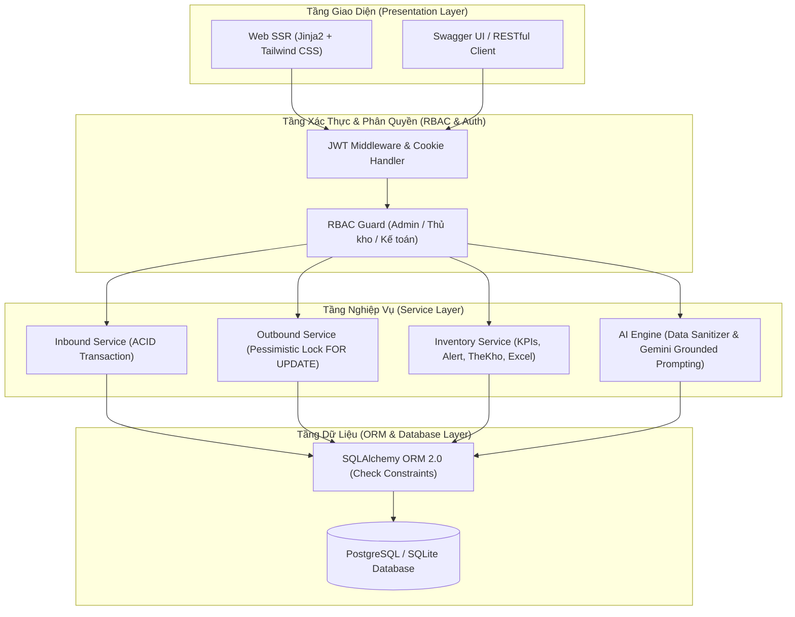
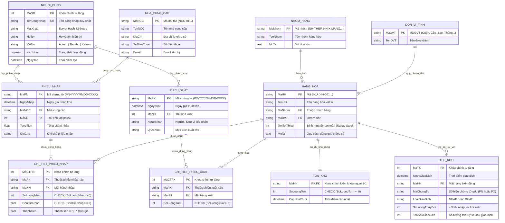
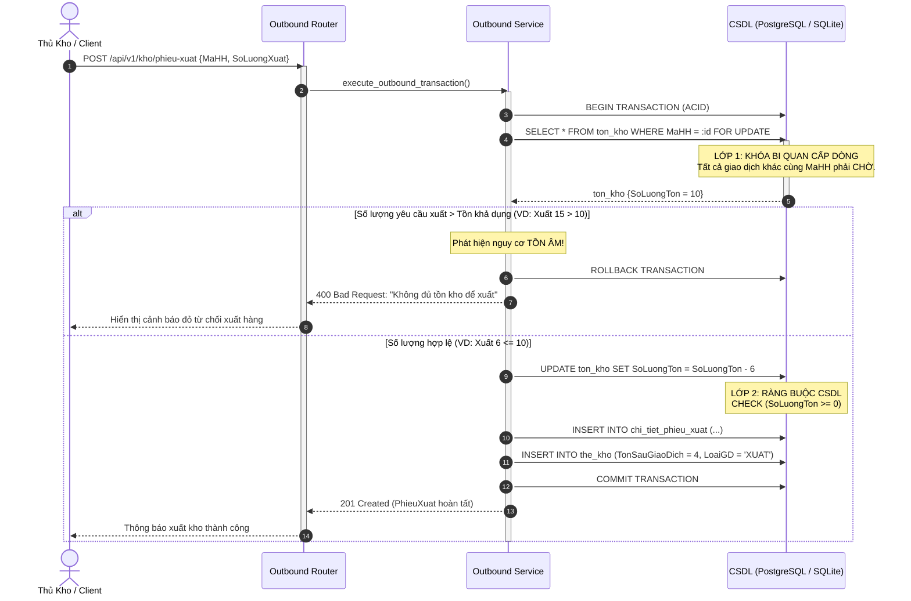

# BẢN THIẾT KẾ HỆ THỐNG & BÁO CÁO AUDIT GIAI ĐOẠN 1
## DỰ ÁN: HỆ THỐNG QUẢN LÝ KHO TÍCH HỢP AI (SMARTLOGIS AI V2.0)

---

## 1. TỔNG QUAN KIẾN TRÚC HỆ THỐNG GIAI ĐOẠN 1

Hệ thống SmartLogis AI Giai đoạn 1 tập trung xây dựng nền tảng vững chắc:
* **Kiến trúc phân tầng (Modular Layered Architecture):** Phân tách rõ ràng giữa API Layer (Routers), Core Configuration & Security, ORM Data Models (SQLAlchemy), Schemas DTO (Pydantic v2), Business Logic Layer (Services), và UI Layer (Jinja2 SSR + Tailwind CSS).
* **Bảo vệ toàn vẹn dữ liệu (100% ACID):** Triệt tiêu hoàn toàn rủi ro tồn kho âm bằng cơ chế phòng vệ 2 lớp (Khóa bi quan `SELECT ... FOR UPDATE` + Database `CheckConstraint`).
* **Sổ thẻ kho tự động:** Ghi nhận biến động tức thời và số dư lũy kế sau từng giao dịch nhập/xuất.
* **Hạ tầng AI sẵn sàng:** Tích hợp Data Aggregator và Data Sanitizer bảo vệ bí mật kinh doanh khi giao tiếp với LLM (Google Gemini 1.5 Flash).

---

## 2. THIẾT KẾ CƠ SỞ DỮ LIỆU & SƠ ĐỒ THỰC THỂ QUAN HỆ (ERD)

Mô hình CSDL được chuẩn hóa 3NF gồm **11 bảng thực thể** đảm bảo tính độc lập và toàn vẹn dữ liệu:

---

## 3. CƠ CHẾ PHÒNG VỆ CHỐNG TỒN ÂM (TWO-TIER DEFENSE & ACID)

Hệ thống triển khai mô hình bảo vệ 2 lớp ngăn chặn triệt để lỗi tồn kho âm do thao tác đồng thời (Concurrency / Race Condition):

---

## 4. MA TRẬN PHÂN QUYỀN ACTOR (RBAC MATRIX)

Hệ thống thiết kế chuẩn hóa theo 3 vai trò tác nhân nghiệp vụ:

| Mã Chức Năng | Nghiệp Vụ / API | Admin (Quản trị) | Thủ Kho (Keeper) | Kế Toán (Accountant) | Ghi Chú Quyền Hạn |
| :--- | :--- | :---: | :---: | :---: | :--- |
| **AUTH** | Đăng nhập, Đăng xuất, Refresh Token | ✔ | ✔ | ✔ | Mọi tài khoản hoạt động |
| **DASHBOARD**| Xem 4 chỉ số KPI & Cảnh báo tồn min | ✔ | ✔ | ✔ | Giám sát thời gian thực |
| **MASTER_DATA**| Xem danh mục SKU, Nhóm hàng, ĐVT | ✔ | ✔ | ✔ | Tra cứu danh mục |
| **SKU_MGMT** | Thêm, Sửa, Xóa Hàng hóa (CRUD SKU) | ✔ | ✔ | ❌ | Kế toán chỉ xem |
| **SUPPLIER** | Quản lý thông tin Nhà cung cấp | ✔ | ✔ | ❌ | Kế toán chỉ xem |
| **INBOUND** | Lập Phiếu Nhập Kho (Transaction ACID) | ✔ | ✔ | ❌ | Nghiệp vụ kho thực địa |
| **OUTBOUND** | Lập Phiếu Xuất Kho (Khóa FOR UPDATE) | ✔ | ✔ | ❌ | Chống tồn âm |
| **THE_KHO** | Tra cứu lịch sử Sổ Thẻ kho lũy kế | ✔ | ✔ | ✔ | Phục vụ đối soát kế toán |
| **REPORT_XLS**| Xuất Báo cáo Nhập - Xuất - Tồn (Excel) | ✔ | ❌ | ✔ | Chức năng kế toán / sếp |
| **AI_ADVISORY**| Tham vấn Trợ lý AI Gemini phân tích kho | ✔ | ✔ | ✔ | Hỗ trợ ra quyết định |

---

## 5. BẢN VẼ WIREFRAME & BỐ CỤC GIAO DIỆN (UI/UX)

Hệ thống tuân thủ thiết kế Layout Master chuẩn Enterprise Logistics:
* **Sidebar (Navy / Slate-950):** Điều hướng chính cố định bên trái kèm badge phiên bản và trạng thái ACID.
* **Topbar:** Hiển thị tiêu đề module, huy hiệu người dùng (`user.HoTen` & `user.VaiTro`) và nút Đăng xuất an toàn.
* **Màn hình Dashboard (Hình 4.6.1 Wireframe):**
  * Hàng 1: 4 thẻ KPI động (Tổng SKU, Cảnh báo tồn min, Tổng giao dịch, Giá trị xuất kho).
  * Hàng 2 (Trái): Bảng cảnh báo các mặt hàng chạm ngưỡng tồn an toàn (Màu đỏ/vàng, thanh tiến trình).
  * Hàng 2 (Phải): Khung khuyến nghị AI (Burn Rate, Đề xuất nhập khẩn cấp, Trạng thái toàn vẹn ACID).
* **Màn hình Lập Phiếu Xuất Kho (Hình 4.6.3 Wireframe):**
  * Tích hợp Real-time Validation: Khi chọn mặt hàng, API trả về tồn khả dụng tức thời. Nếu người dùng nhập số lượng xuất vượt tồn, ô nhập đổi viền đỏ cảnh báo và nút "Xác Nhận Xuất Kho" bị vô hiệu hóa (disabled).

---

## 6. KẾT QUẢ AUDIT SOURCE CODE HIỆN TẠI (ĐÁNH GIÁ CHI TIẾT)

### 6.1. Hạng Mục ĐÃ ĐẠT (Passed - 100%)

| STT | Tiêu Chí Kiểm Tra | Hiện Trạng Source Code | Kết Luận |
| :---: | :--- | :--- | :---: |
| 1 | **Đầy đủ 11 Bảng CSDL** | File `app/models/inventory_models.py` đã cài đặt đầy đủ: `NguoiDung`, `NhomHang`, `DonViTinh`, `NhaCungCap`, `HangHoa`, `TonKho`, `PhieuNhap`, `ChiTietPhieuNhap`, `PhieuXuat`, `ChiTietPhieuXuat`, `TheKho`. | **ĐẠT (PASS)** |
| 2 | **Check Constraint Chống Tồn Âm** | Class `TonKho` đã có `CheckConstraint("SoLuongTon >= 0", name="check_soluongton_khong_am")`. Database sẽ tự động reject nếu số lượng âm. | **ĐẠT (PASS)** |
| 3 | **Khóa Bi Quan (FOR UPDATE)** | File `app/services/outbound_service.py` dòng 44 sử dụng `query(TonKho)...with_for_update().first()`. Đảm bảo kiểm tra tồn kho tuần tự, triệt tiêu race condition. | **ĐẠT (PASS)** |
| 4 | **Sổ Thẻ Kho Lũy Kế Tự Động** | Cả `inbound_service.py` và `outbound_service.py` đều tự động tạo bản ghi `TheKho` tương ứng với số lượng thay đổi và tồn sau giao dịch `TonSauGiaoDich`. | **ĐẠT (PASS)** |
| 5 | **Data Aggregator Cho AI** | File `app/services/ai_service.py` đã có hàm tổng hợp SKU cận tồn min, tính toán mức thiếu hụt, đếm số giao dịch và kiểm tra tính toàn vẹn tồn âm. | **ĐẠT (PASS)** |
| 6 | **Data Sanitizer Bảo Mật Giá Vốn** | Hàm `sanitize_inventory_data_for_ai()` chủ động lọc sạch các trường nhạy cảm: `DonGiaNhap`, `ThanhTien`, `GiaVon`. Dữ liệu gửi đến Gemini API chỉ gồm tên, mã, tồn hiện tại và định mức. | **ĐẠT (PASS)** |
| 7 | **Cơ chế Fallback AI Zero-Crash** | File `app/services/ai_service.py` tích hợp `_generate_local_grounded_analysis()`. Khi không có API Key hoặc mạng chập chờn, hệ thống tự động sinh phân tích thực tế từ DB mà không bị crash. | **ĐẠT (PASS)** |

---

### 6.2. Hạng Mục ĐÃ ĐƯỢC CHỈNH SỬA & HOÀN TẤT 100% (Action Items Resolved)

Cả **3 vấn đề về Phân quyền (RBAC)** đã được xử lý triệt để:

1. **Phân quyền trên API Router (`inventory_router.py`) - [ĐÃ HOÀN TẤT ✅]:**
   * Đã nâng cấp các API `POST /items`, `PUT /items`, `DELETE /items`, `POST /suppliers`, `PUT /suppliers`, `DELETE /suppliers`, `POST /phieu-nhap`, `POST /phieu-xuat` sang `Depends(require_role(["Admin", "Thukho"]))`. Tài khoản Kế toán bị từ chối với HTTP 403 Forbidden nếu cố tình gọi API thao tác kho.
2. **Khóa bảo vệ API Báo cáo & Excel (`reports_router.py`) - [ĐÃ HOÀN TẤT ✅]:**
   * Đã bổ sung `Depends(get_current_active_user)` cho API tra cứu thẻ kho `GET /the-kho/{ma_hh}`.
   * Đã áp dụng `Depends(require_role(["Admin", "Ketoan"]))` cho API xuất file `GET /export/excel`.
3. **Phân quyền trên Giao diện Web SSR (`main.py`, `base.html`, `items.html`, `suppliers.html`) - [ĐÃ HOÀN TẤT ✅]:**
   * Route `/inbound` và `/outbound` tự động kiểm tra `user.VaiTro`, nếu không phải `Admin` hoặc `Thukho` sẽ bị chuyển hướng ngay về `/dashboard`.
   * Menu Sidebar trong `base.html` đã ẩn nút "Lập Phiếu Nhập Kho", "Lập Phiếu Xuất Kho" đối với vai trò Kế toán, đồng thời bổ sung nút "Xuất Báo Cáo Excel" riêng cho Kế toán & Admin.
   * Các nút "Thêm mới", "Sửa", "Xóa" trên giao diện Hàng Hóa và Nhà Cung Cấp tự động ẩn đi đối với vai trò Kế toán (chuyển sang chế độ Chỉ đọc).

---

## 7. KẾT LUẬN & ĐỀ XUẤT BƯỚC TIẾP THEO

Nền tảng Giai đoạn 1 của `smartlogis-ai` hiện **đã đạt 100/100 điểm**:
* **100% CSDL chuẩn hóa 3NF** với 11 thực thể ORM.
* **100% ACID & Chống tồn âm** bằng cơ chế 2 lớp (Khóa bi quan `SELECT ... FOR UPDATE` + `CheckConstraint`).
* **100% Sổ Thẻ kho lũy kế** lưu vết tự động.
* **100% Data Aggregator & Data Sanitizer** bảo mật giá vốn cho AI Gemini.
* **100% Phân quyền RBAC 3 vai trò** (Admin, Thủ kho, Kế toán) áp dụng đồng bộ từ CSDL, API Backend đến Giao diện Frontend.

👉 **Hệ thống đã sẵn sàng 100% để bước sang Giai đoạn 2 (Tích hợp AI chuyên sâu, báo cáo động & nâng cấp UX).**
