# HỆ THỐNG TÀI LIỆU SƠ ĐỒ THIẾT KẾ KIẾN TRÚC & QUY TRÌNH NGHIỆP VỤ SMARTLOGIS AI
> **Phiên bản:** 2.0 (Chuẩn hóa Kiến trúc phần mềm & Cú pháp Mermaid.js theo Skill `diagram-architect`)  
> **Hệ thống:** Phần mềm Quản lý Kho Thông minh SmartLogis AI  
> **Nhóm thực hiện:** Nguyễn Thành Hưng (Product Owner / Backend) & Hoàng Tiến Đạt (Scrum Master / Frontend & QA)  
> **Cơ sở dữ liệu:** MySQL 8.0 (ACID Engine, InnoDb, Check Constraints)  
> **Trợ lý AI:** Google Gemini 1.5 Flash API (Data Sanitizer & Fallback Rule-based Engine)

---

## MỤC LỤC TỔNG HỢP CÁC SƠ ĐỒ HỆ THỐNG

1. [Sơ đồ 1: Quy trình Scrum trong Phát triển Hệ thống (3 Sprint - 6 Tuần)](#1-sơ-đồ-quy-trình-scrum-trong-phát-triển-hệ-thống) *(Hình 1.5 - `image2.png`)*
2. [Sơ đồ 2: Sơ đồ Cây Phân Rã Chức Năng Hệ Thống (Functional Decomposition)](#2-sơ-đồ-cây-phân-rã-chức-năng-hệ-thống) *(Hình 4.1a - `image20.png`)*
3. [Sơ đồ 3: Sơ đồ Kiến Trúc Phân Hệ Chức Năng Toàn Diện](#3-sơ-đồ-kiến-trúc-phân-hệ-chức-năng-toàn-diện) *(Hình 2.2.3 - `image3.png`)*
4. [Sơ đồ 4: Biểu đồ Use Case Tổng Quát Hệ Thống Quản Lý Kho SmartLogis AI](#4-biểu-đồ-use-case-tổng-quát) *(Hình 4.1 - `image4.png`)*
5. [Sơ đồ 5: Biểu đồ Use Case Phân Hệ Nghiệp Vụ Kho & Chống Tồn Âm (ACID)](#5-biểu-đồ-use-case-phân-hệ-nghiệp-vụ-kho) *(Hình 4.1.1 - `image5.png`)*
6. [Sơ đồ 6: Biểu đồ Use Case Phân Hệ Trợ Lý AI & Khử Trùng Giá Vốn](#6-biểu-đồ-use-case-phân-hệ-trợ-lý-ai) *(Hình 4.1.2 - `image6.png`)*
7. [Sơ đồ 7: Biểu đồ Tuần Tự (Sequence Diagram) - Lập Phiếu Xuất Kho & Khóa ACID](#7-sequence-diagram---lập-phiếu-xuất-kho--khóa-acid) *(Hình 4.2.1 - `image7.png`)*
8. [Sơ đồ 8: Biểu đồ Tuần Tự (Sequence Diagram) - AI Sinh Báo Cáo Nhập - Xuất - Tồn](#8-sequence-diagram---ai-sinh-báo-cáo-nhập---xuất---tồn) *(Hình 4.2.2 - `image8.png`)*
9. [Sơ đồ 9: Biểu đồ Tuần Tự (Sequence Diagram) - Lập Phiếu Nhập Kho & Ghi Sổ Thẻ Kho](#9-sequence-diagram---lập-phiếu-nhập-kho--ghi-sổ-thẻ-kho) *(Hình 4.2.3 - `image9.png`)*
10. [Sơ đồ 10: Biểu đồ Tuần Tự (Sequence Diagram) - Tra Cứu Thẻ Kho & Cảnh Báo Tồn Tối Thiểu](#10-sequence-diagram---tra-cứu-thẻ-kho--cảnh-báo-tồn-tối-thiểu) *(Hình 4.2.4 - `image10.png`)*
11. [Sơ đồ 11: Biểu đồ Tuần Tự (Sequence Diagram) - Xuất Báo Cáo Dữ Liệu Ra File Excel](#11-sequence-diagram---xuất-báo-cáo-dữ-liệu-ra-file-excel) *(Hình 4.2.5 - `image11.png`)*
12. [Sơ đồ 12: Biểu đồ Tuần Tự (Sequence Diagram) - Đăng Nhập & Phân Quyền Truy Cập JWT](#12-sequence-diagram---đăng-nhập--phân-quyền-truy-cập-jwt) *(Hình 4.2.6 - `image12.png`)*
13. [Sơ đồ 13: Sơ đồ Thực Thể Quan Hệ Cơ Sở Dữ Liệu Cụ Thể (Physical Database ERD Schema MySQL 8.0)](#13-sơ-đồ-thực-thể-quan-hệ-cơ-sở-dữ-liệu-cụ-thể-erd) *(Hình 4.3.3 - `image13.png`)*
14. [Sơ đồ 14: Biểu đồ Hoạt Động (Activity Diagram) - Nghiệp Vụ Xuất Kho Chống Tồn Âm Đa Tầng](#14-activity-diagram---nghiệp-vụ-xuất-kho-chống-tồn-âm) *(Hình 4.4.1 - `image14.png`)*
15. [Sơ đồ 15: Biểu đồ Hoạt Động (Activity Diagram) - Trợ Lý AI & Quy Trình Khử Trùng Giá Vốn](#15-activity-diagram---trợ-lý-ai--data-sanitizer) *(Hình 4.4.2 - `image15.png`)*
16. [Sơ đồ 16: Biểu đồ Lớp (Class Diagram) - Kiến Trúc Backend FastAPI & Domain Services](#16-class-diagram---kiến-trúc-backend-fastapi--domain-services) *(Hình 4.5.1 - `image16.png`)*

---

## 1. Sơ đồ Quy trình Scrum trong Phát triển Hệ thống
- **Mã ảnh báo cáo Word:** `word/media/image2.png` *(Hình 1.5)*
- **Ý nghĩa kỹ thuật:** Mô tả vòng đời lặp phát triển 3 Sprint (mỗi Sprint 2 tuần, tổng cộng 6 tuần) từ Product Backlog (10 User Stories) qua Sprint Planning, Sprint Backlog, Sprint Execution (Daily Scrum 15 phút), Sprint Review và Sprint Retrospective. Vòng lặp cải tiến liên tục nối tuần hoàn cho Sprint kế tiếp.

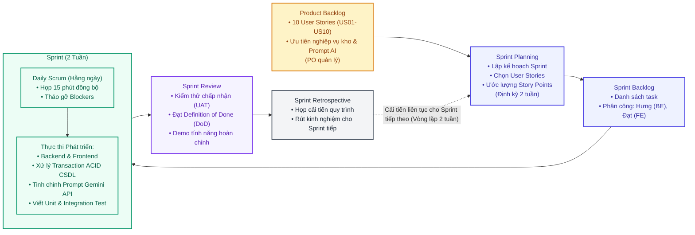

---

## 2. Sơ đồ Cây Phân Rã Chức Năng Hệ Thống
- **Mã ảnh báo cáo Word:** `word/media/image20.png` *(Hình 4.1a)*
- **Ý nghĩa kỹ thuật:** Phân tách phân cấp toàn bộ chức năng SmartLogis AI thành 4 phân hệ chính: Quản trị & Xác thực, Nghiệp vụ Kho & Kiểm soát ACID, Báo cáo & Thống kê Tồn kho, Trợ lý AI & Phân tích Tự động.

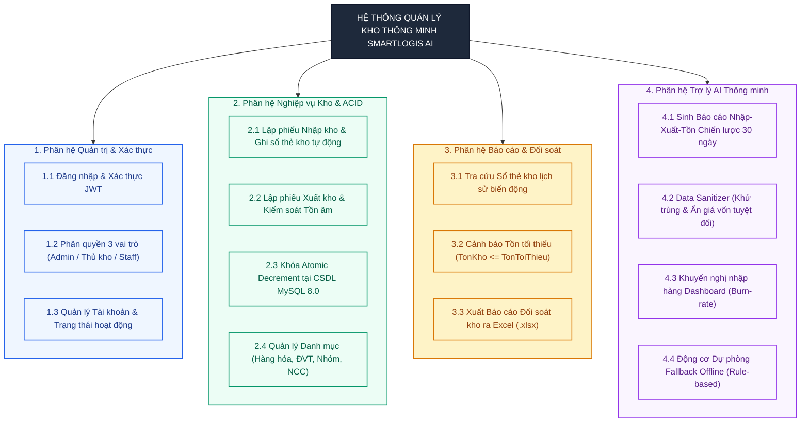

---

## 3. Sơ đồ Kiến Trúc Phân Hệ Chức Năng Toàn Diện
- **Mã ảnh báo cáo Word:** `word/media/image3.png` *(Hình 2.2.3)*
- **Ý nghĩa kỹ thuật:** Mô tả luồng tương tác giữa Client Frontend (HTML5/Vanilla CSS/Modern JS), Tầng API Reverse Proxy & Gateway, Backend FastAPI xử lý nghiệp vụ ACID, CSDL MySQL 8.0 InnoDb, và Dịch vụ ngoài Google Gemini 1.5 Flash API.

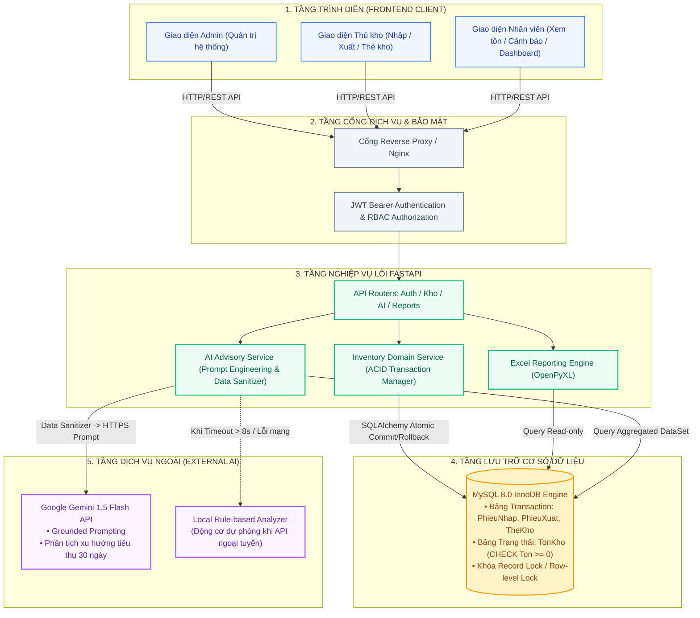

---

## 4. Biểu đồ Use Case Tổng Quát
- **Mã ảnh báo cáo Word:** `word/media/image4.png` *(Hình 4.1)*
- **Ý nghĩa kỹ thuật:** Toàn bộ 13 ca sử dụng của hệ thống phân bố theo kiến trúc 2 cột. Các Actor người dùng (Admin, Thủ kho kiêm Kế toán, Nhân viên kho) kết nối vào mép trái các Use Case Cột 1; các quan hệ `<<include>>` đi qua hành lang giữa sang Cột 2; Trợ lý AI (Google Gemini 1.5) kết nối vào mép phải.

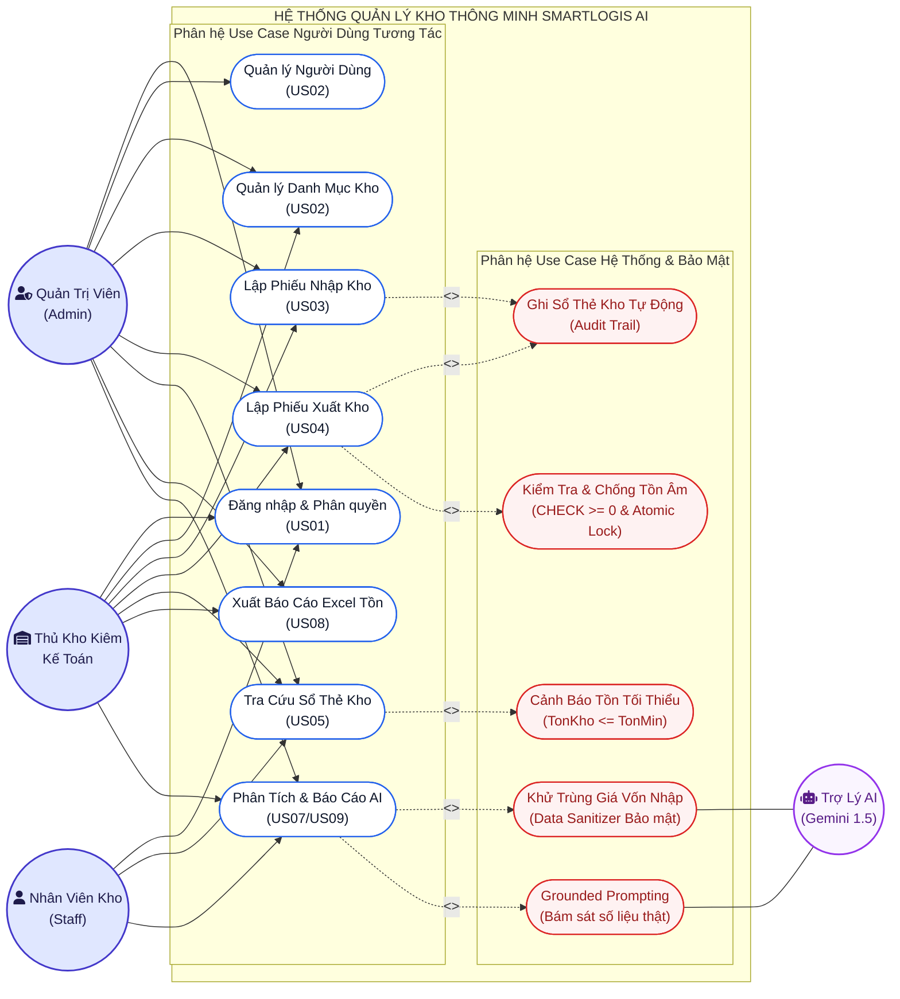

---

## 5. Biểu đồ Use Case Phân Hệ Nghiệp Vụ Kho
- **Mã ảnh báo cáo Word:** `word/media/image5.png` *(Hình 4.1.1)*
- **Ý nghĩa kỹ thuật:** Tập trung chuyên sâu vào quy trình nghiệp vụ xuất nhập tồn và cơ chế bảo vệ toàn vẹn dữ liệu ACID chống bán khống, chống âm kho.

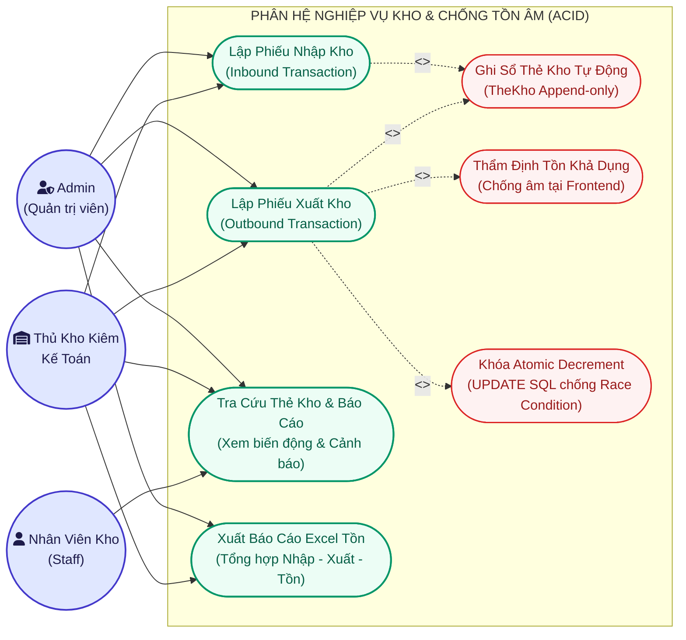

---

## 6. Biểu đồ Use Case Phân Hệ Trợ Lý AI
- **Mã ảnh báo cáo Word:** `word/media/image6.png` *(Hình 4.1.2)*
- **Ý nghĩa kỹ thuật:** Làm rõ cơ chế tương tác với Google Gemini 1.5 Flash API, quy trình Data Sanitizer loại bỏ giá vốn nhập trước khi gửi prompt ra ngoài, và cơ chế mở rộng Fallback sang Động cơ Offline khi mất mạng.

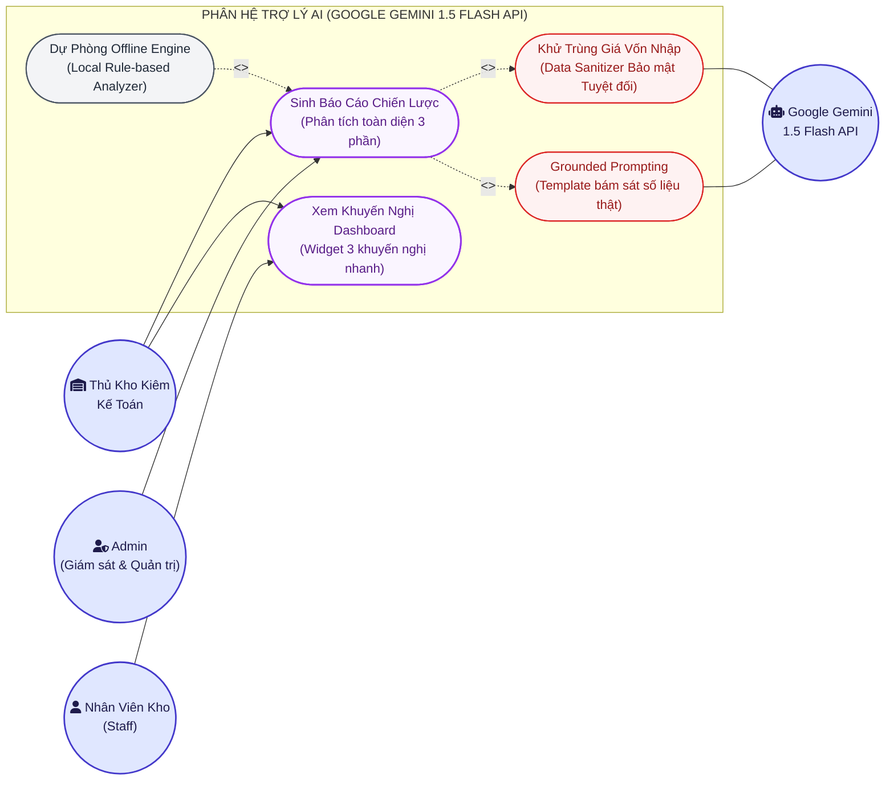

---

## 7. Sequence Diagram - Lập Phiếu Xuất Kho & Khóa ACID
- **Mã ảnh báo cáo Word:** `word/media/image7.png` *(Hình 4.2.1)*
- **Ý nghĩa kỹ thuật:** Mô tả giao dịch ACID chống tồn âm với câu lệnh khóa dòng nguyên tử: `UPDATE ton_kho SET so_luong = so_luong - :qty WHERE ma_hh = :id AND so_luong >= :qty`.

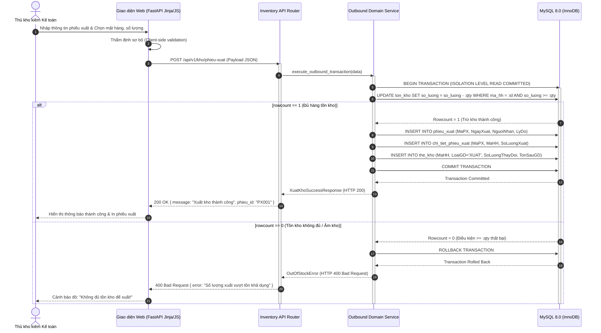

---

## 8. Sequence Diagram - AI Sinh Báo Cáo Nhập - Xuất - Tồn
- **Mã ảnh báo cáo Word:** `word/media/image8.png` *(Hình 4.2.2)*
- **Ý nghĩa kỹ thuật:** Quy trình Data Sanitizer bảo mật giá vốn và cơ chế Fallback sang Local Rule-based Analyzer khi kết nối Google Gemini API bị timeout hoặc mất mạng.

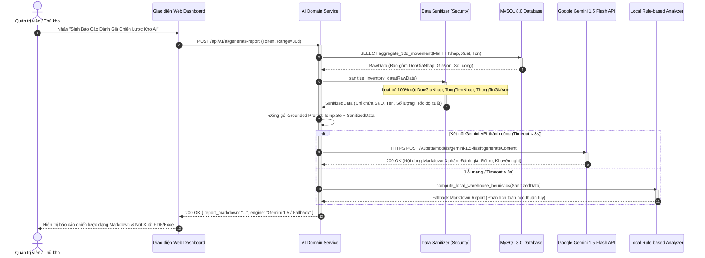

---

## 9. Sequence Diagram - Lập Phiếu Nhập Kho & Ghi Sổ Thẻ Kho
- **Mã ảnh báo cáo Word:** `word/media/image9.png` *(Hình 4.2.3)*
- **Ý nghĩa kỹ thuật:** Ghi nhận phiếu nhập hàng hóa, tăng số lượng tồn kho tức thì và append-only vào bảng sổ thẻ kho `the_kho` để làm căn cứ đối soát kế toán.

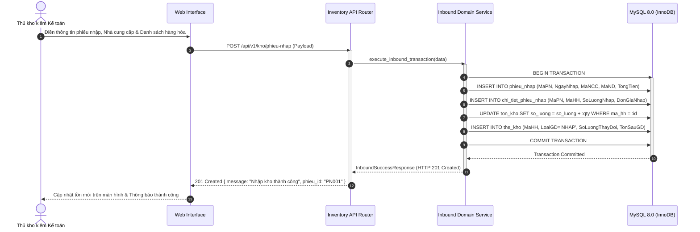

---

## 10. Sequence Diagram - Tra Cứu Thẻ Kho & Cảnh Báo Tồn Tối Thiểu
- **Mã ảnh báo cáo Word:** `word/media/image10.png` *(Hình 4.2.4)*
- **Ý nghĩa kỹ thuật:** Truy vấn lịch sử biến động thẻ kho lũy kế và đối soát với ngưỡng `TonToiThieu` để kích hoạt cảnh báo trực quan cho nhân viên và thủ kho.

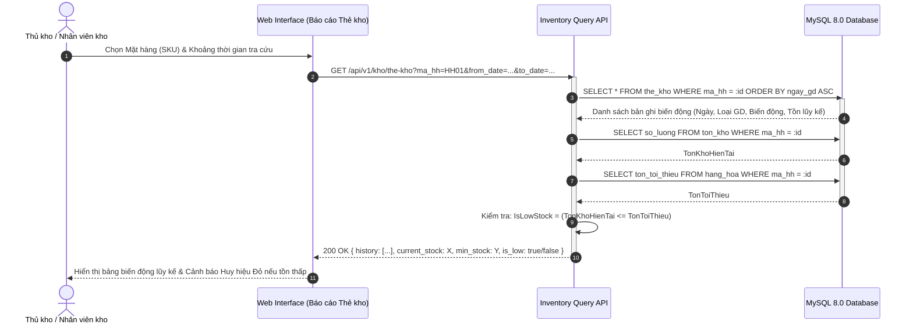

---

## 11. Sequence Diagram - Xuất Báo Cáo Dữ Liệu Ra File Excel
- **Mã ảnh báo cáo Word:** `word/media/image11.png` *(Hình 4.2.5)*
- **Ý nghĩa kỹ thuật:** Trích xuất toàn bộ bảng cân đối nhập - xuất - tồn, đóng gói định dạng file Excel `.xlsx` tương thích các phần mềm kế toán.

```mermaid
sequenceDiagram
    autonumber
    actor User as Thủ kho kiêm Kế toán / Admin
    participant Web as Web Interface
    participant ReportAPI as Report API Router
    participant ExcelEngine as OpenPyXL Excel Generator
    participant DB as MySQL 8.0 Database

    User ->> Web: Nhấn "Xuất Báo Cáo Tồn Kho Excel (.xlsx)"
    Web ->> ReportAPI: GET /api/v1/reports/export-inventory-excel
    activate ReportAPI

    ReportAPI ->> DB: Truy vấn tổng hợp: HangHoa, TonKho, Tổng Nhập, Tổng Xuất
    activate DB
    DB -->> ReportAPI: Tập dữ liệu đối soát tồn kho
    deactivate DB

    ReportAPI ->> ExcelEngine: generate_inventory_workbook(data)
    activate ExcelEngine
    ExcelEngine ->> ExcelEngine: Format Header, Font, Cột Tiền Tệ, Border, Cảnh báo màu
    ExcelEngine -->> ReportAPI: File Stream Binary (application/vnd.openxmlformats...)
    deactivate ExcelEngine

    ReportAPI -->> Web: HTTP 200 OK (Content-Disposition: attachment; filename="BaoCaoTonKho.xlsx")
    deactivate ReportAPI
    Web -->> User: Trình duyệt tải file Excel về máy tính thành công
```

---

## 12. Sequence Diagram - Đăng Nhập & Phân Quyền Truy Cập JWT
- **Mã ảnh báo cáo Word:** `word/media/image12.png` *(Hình 4.2.6)*
- **Ý nghĩa kỹ thuật:** Xác thực người dùng bằng mật khẩu băm Bcrypt, cấp phát JSON Web Token (JWT) có chữ ký số bí mật và kiểm tra quyền hạn (RBAC) theo từng vai trò.

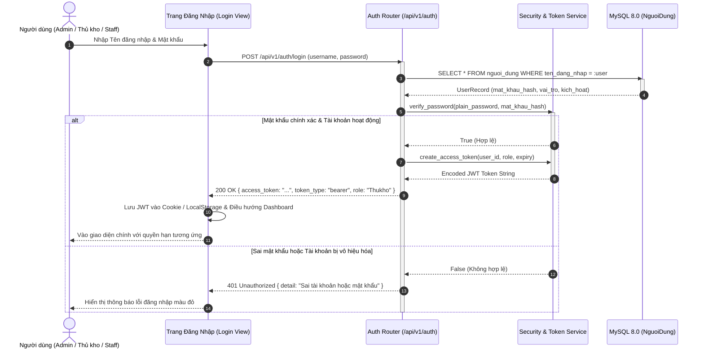

---

## 13. Sơ đồ Thực Thể Quan Hệ Cơ Sở Dữ Liệu Cụ Thể (ERD)
- **Mã ảnh báo cáo Word:** `word/media/image13.png` *(Hình 4.3.3)*
- **Ý nghĩa kỹ thuật:** Toàn bộ 11 bảng cơ sở dữ liệu MySQL 8.0 với đầy đủ các mối quan hệ khóa ngoại (Foreign Keys), ràng buộc kiểm tra toàn vẹn `CHECK (SoLuongTon >= 0)` và chỉ mục tối ưu hóa hiệu năng.

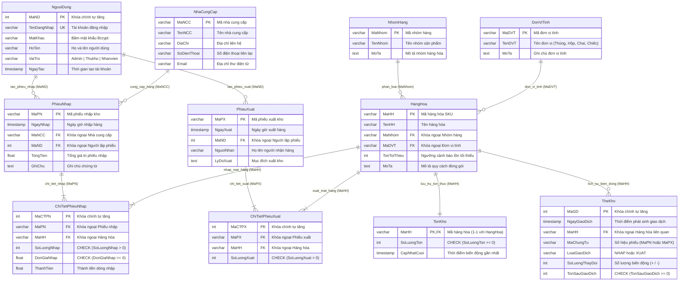

---

## 14. Activity Diagram - Nghiệp Vụ Xuất Kho Chống Tồn Âm
- **Mã ảnh báo cáo Word:** `word/media/image14.png` *(Hình 4.4.1)*
- **Ý nghĩa kỹ thuật:** Quy trình luồng nghiệp vụ xuất kho chuẩn hóa: Kiểm tra số lượng tồn bằng Atomic Decrement tại Database, nếu không đủ hàng sẽ Rollback và trả HTTP 400; nếu đủ hàng sẽ ghi ChiTietPhieuXuat, lưu vết TheKho và Commit Transaction.

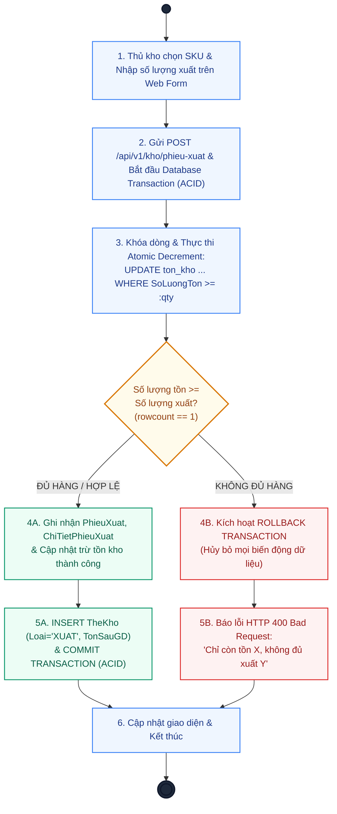

---

## 15. Activity Diagram - Trợ Lý AI & Data Sanitizer
- **Mã ảnh báo cáo Word:** `word/media/image15.png` *(Hình 4.4.2)*
- **Ý nghĩa kỹ thuật:** Toàn bộ 7 bước của quy trình Trợ lý AI: Truy vấn 30 ngày, Khử trùng giá vốn bí mật bằng Data Sanitizer, Đóng gói Grounded Prompt, Gọi Gemini 1.5 Flash API có kiểm soát Timeout 8 giây, Rẽ nhánh Fallback SQL Engine nội bộ nếu mạng lỗi, và Kết xuất báo cáo 3 phần.

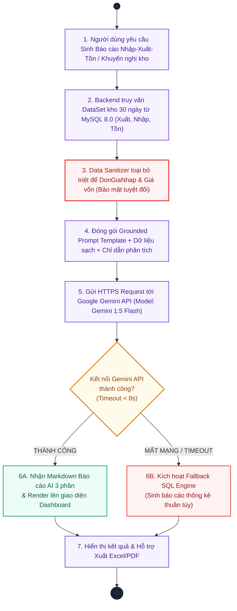

---

## 16. Class Diagram - Kiến Trúc Backend FastAPI & Domain Services
- **Mã ảnh báo cáo Word:** `word/media/image16.png` *(Hình 4.5.1)*
- **Ý nghĩa kỹ thuật:** Phân tầng phần mềm kiến trúc 3 lớp chuẩn mực: API Controllers/Routers -> Domain Services (Nghiệp vụ ACID & AI) -> SQLAlchemy ORM Persistence Models, cùng các đường nối quan hệ ngữ nghĩa chuẩn UML.

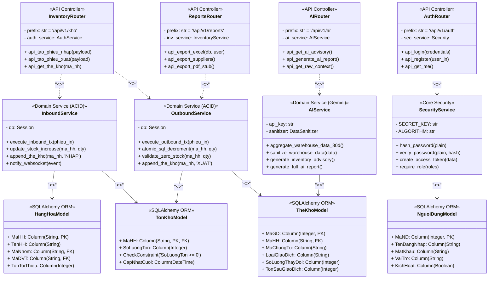

---
*Tài liệu được sinh tự động và chuẩn hóa bởi Antigravity Skill `diagram-architect`.*
