# HỆ THỐNG SƠ ĐỒ KỸ THUẬT KIẾN TRÚC SMARTLOGIS AI V2.0
## CHUẨN HÓA MÔ HÌNH VAI TRÒ "THỦ KHO KIÊM KẾ TOÁN" (MERMAID.JS ARCHITECT)
**Dự án:** SmartLogis AI - Hệ Thống Quản Lý Kho Tích Hợp AI  
**Tiêu chuẩn thiết kế:** Cú pháp Mermaid.js chuẩn hóa theo Skill `diagram-architect`  
**Cơ cấu nhân sự dự án (02 Thành viên Scrum):**
- **Nguyễn Thành Hưng:** Product Owner / Lead Backend Developer $\rightarrow$ Vai trò hệ thống: **Admin (Quản trị viên)**
- **Hoàng Tiến Đạt:** Scrum Master / Frontend Developer & Tester $\rightarrow$ Vai trò hệ thống: **Thủ kho kiêm Kế toán (Storekeeper & Accountant)**
- **Dịch vụ tích hợp bên ngoài:** **Trợ lý AI (Google Gemini 1.5 Flash API)**

---

## MỤC LỤC HỆ THỐNG SƠ ĐỒ
1. [Sơ đồ Use Case Tổng Quát (Hình 4.1)](#1-sơ-đồ-use-case-tổng-quát-hình-41)
2. [Sơ đồ Use Case Phân Hệ Nghiệp Vụ Kho & Chống Tồn Âm (Hình 4.1.1)](#2-sơ-đồ-use-case-phân-hệ-nghiệp-vụ-kho--chống-tồn-âm-hình-411)
3. [Sơ đồ Use Case Phân Hệ Trợ Lý AI Gemini (Hình 4.1.2)](#3-sơ-đồ-use-case-phân-hệ-trợ-lý-ai-gemini-hình-412)
4. [Sơ đồ Trình Tự Lập Phiếu Xuất Kho & Khóa Chống Tồn Âm (Hình 4.2.1)](#4-sơ-đồ-trình-tự-lập-phiếu-xuất-kho--khóa-chống-tồn-âm-hình-421)
5. [Sơ đồ Trình Tự AI Sinh Báo Cáo Nhập - Xuất - Tồn (Hình 4.2.2)](#5-sơ-đồ-trình-tự-ai-sinh-báo-cáo-nhập---xuất---tồn-hình-422)
6. [Sơ đồ Trình Tự Lập Phiếu Nhập Kho (Inbound Transaction) (Hình 4.2.3)](#6-sơ-đồ-trình-tự-lập-phiếu-nhập-kho-inbound-transaction-hình-423)
7. [Sơ đồ Trình Tự Tra Cứu Thẻ Kho & Cảnh Báo Tồn Min (Hình 4.2.4)](#7-sơ-đồ-trình-tự-tra-cứu-thẻ-kho--cảnh-báo-tồn-min-hình-424)
8. [Sơ đồ Trình Tự Xuất Báo Cáo Excel / PDF (Hình 4.2.5)](#8-sơ-đồ-trình-tự-xuất-báo-cáo-excel--pdf-hình-425)
9. [Sơ đồ Trình Tự Đăng Nhập & Phân Quyền JWT (Hình 4.2.6)](#9-sơ-đồ-trình-tự-đăng-nhập--phân-quyền-jwt-hình-426)
10. [Sơ đồ Thực Thể Quan Hệ Cơ Sở Dữ Liệu MySQL 8.0 (Hình 4.3.3)](#10-sơ-đồ-thực-thể-quan-hệ-cơ-sở-dữ-liệu-mysql-80-hình-433)
11. [Sơ đồ Hoạt Động (Activity) Xuất Kho Chống Tồn Âm (Hình 4.4.1)](#11-sơ-đồ-hoạt-động-activity-xuất-kho-chống-tồn-âm-hình-441)
12. [Sơ đồ Hoạt Động (Activity) Trợ Lý AI & Data Sanitizer (Hình 4.4.2)](#12-sơ-đồ-hoạt-động-activity-trợ-lý-ai--data-sanitizer-hình-442)
13. [Sơ đồ Lớp (Class Diagram) Backend FastAPI & Domain Services (Hình 4.5.1)](#13-sơ-đồ-lớp-class-diagram-backend-fastapi--domain-services-hình-451)
14. [Sơ đồ Kiến Trúc Phân Hệ Chức Năng (Hình 2.2.3)](#14-sơ-đồ-kiến-trúc-phân-hệ-chức-năng-hình-223)

---

## 1. Sơ đồ Use Case Tổng Quát (Hình 4.1)

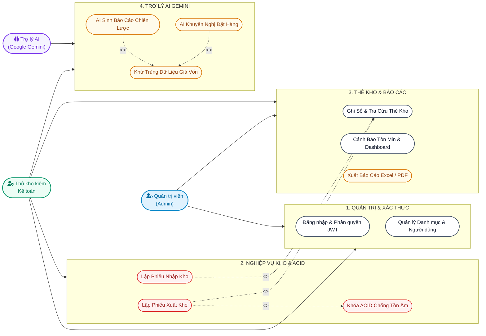

---

## 1.1. Sơ đồ Cây Phân Rã Chức Năng Hệ Thống (Hình 4.1a)

```mermaid
graph TD
    Root["<b>HỆ THỐNG QUẢN LÝ KHO SMARTLOGIS AI</b>"]:::rootStyle

    Root --> S1["<b>1. Phân hệ Quản trị & Xác thực</b>"]:::s1Style
    Root --> S2["<b>2. Phân hệ Nghiệp vụ Kho & ACID</b>"]:::s2Style
    Root --> S3["<b>3. Phân hệ Thẻ kho & Báo cáo</b>"]:::s3Style
    Root --> S4["<b>4. Phân hệ Trợ lý AI Gemini</b>"]:::s4Style

    S1 --> F1_1["1.1. Đăng nhập JWT & Phân quyền"]:::leafStyle
    S1 --> F1_2["1.2. Quản lý Tài khoản Người dùng"]:::leafStyle
    S1 --> F1_3["1.3. Quản lý Danh mục Hàng & NCC"]:::leafStyle

    S2 --> F2_1["2.1. Lập Phiếu Nhập Kho"]:::leafStyle
    S2 --> F2_2["2.2. Lập Phiếu Xuất Kho"]:::leafStyle
    S2 --> F2_3["2.3. Khóa Atomic SQL Chống Tồn Âm"]:::leafStyle

    S3 --> F3_1["3.1. Ghi Sổ & Tra Cứu Thẻ Kho"]:::leafStyle
    S3 --> F3_2["3.2. Giám Sát Định Mức Tồn Min"]:::leafStyle
    S3 --> F3_3["3.3. Xuất Báo Cáo Excel / PDF"]:::leafStyle

    S4 --> F4_1["4.1. Khuyến Nghị Đặt Hàng Tối Ưu"]:::leafStyle
    S4 --> F4_2["4.2. AI Sinh Báo Cáo Chiến Lược"]:::leafStyle
    S4 --> F4_3["4.3. Khử Trùng & Bảo Mật Giá Vốn"]:::leafStyle

    classDef rootStyle fill:#0284c7,stroke:#0369a1,stroke-width:2px,color:#ffffff;
    classDef s1Style fill:#e0f2fe,stroke:#0284c7,stroke-width:2px,color:#0369a1;
    classDef s2Style fill:#ecfdf5,stroke:#059669,stroke-width:2px,color:#047857;
    classDef s3Style fill:#fef3c7,stroke:#d97706,stroke-width:2px,color:#92400e;
    classDef s4Style fill:#f5f3ff,stroke:#7c3aed,stroke-width:2px,color:#6d28d9;
    classDef leafStyle fill:#ffffff,stroke:#64748b,stroke-width:1.5px,color:#0f172a;
```

---

## 2. Sơ đồ Use Case Phân Hệ Nghiệp Vụ Kho & Chống Tồn Âm (Hình 4.1.1)

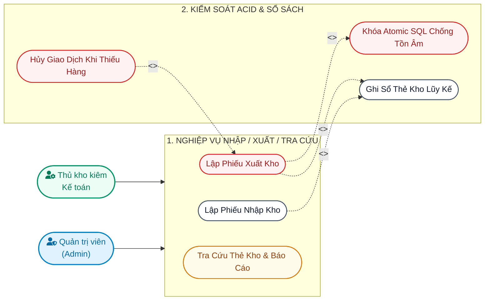

---

## 3. Sơ đồ Use Case Phân Hệ Trợ Lý AI Gemini (Hình 4.1.2)

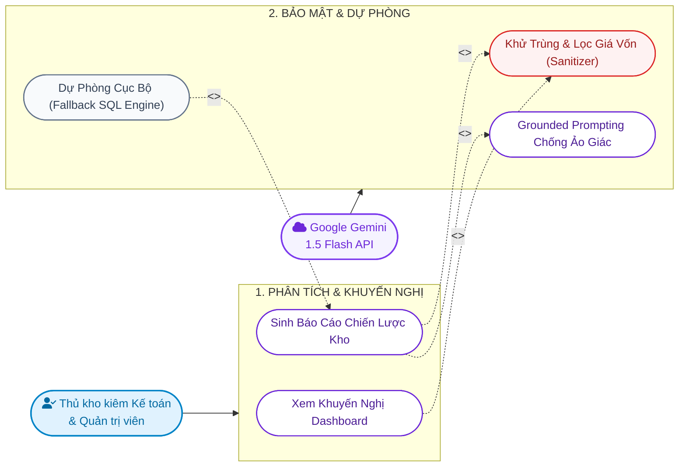

---

## 4. Sơ đồ Trình Tự Lập Phiếu Xuất Kho & Khóa Chống Tồn Âm (Hình 4.2.1)

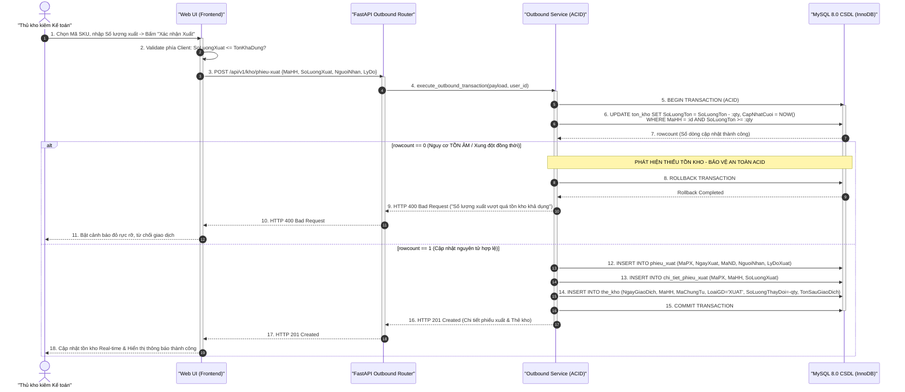

---

## 5. Sơ đồ Trình Tự AI Sinh Báo Cáo Nhập - Xuất - Tồn (Hình 4.2.2)

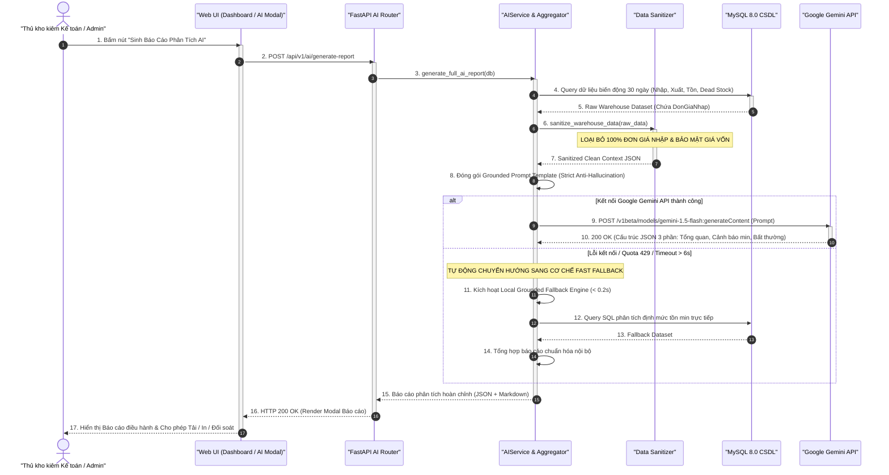

---

## 6. Sơ đồ Trình Tự Lập Phiếu Nhập Kho (Inbound Transaction) (Hình 4.2.3)

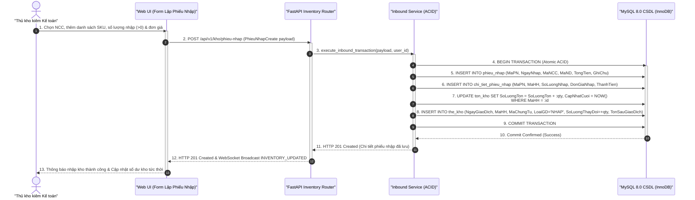

---

## 7. Sơ đồ Trình Tự Tra Cứu Thẻ Kho & Cảnh Báo Tồn Min (Hình 4.2.4)

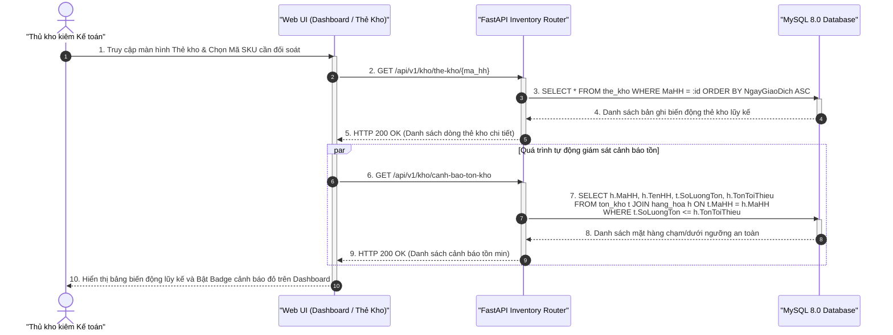

---

## 8. Sơ đồ Trình Tự Xuất Báo Cáo Excel / PDF (Hình 4.2.5)

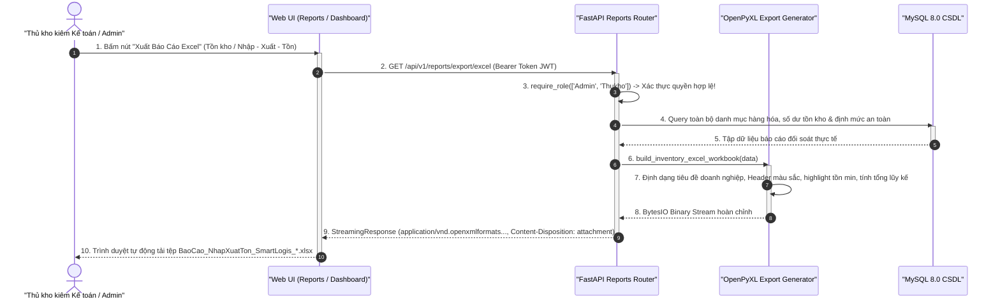

---

## 9. Sơ đồ Trình Tự Đăng Nhập & Phân Quyền JWT (Hình 4.2.6)

```mermaid
sequenceDiagram
    autonumber
    actor User as "Người Dùng (Admin / Thủ kho kiêm KT)"
    participant UI as "Web UI (Form /login)"
    participant Router as "FastAPI Auth Router"
    participant Security as "Security Service (Bcrypt/JWT)"
    participant DB as "MySQL 8.0 CSDL"

    User ->> UI: 1. Nhập Tên đăng nhập và Mật khẩu
    activate UI
    UI ->> Router: 2. POST /api/v1/auth/login (TenDangNhap, MatKhau)
    activate Router

    Router ->> DB: 3. SELECT * FROM nguoi_dung WHERE TenDangNhap = :u AND KichHoat = true
    activate DB
    DB -->> Router: 4. Bản ghi NguoiDung (Bcrypt Hash, VaiTro: 'Admin' hoặc 'Thukho')
    deactivate DB

    Router ->> Security: 5. verify_password(plain, hash)
    activate Security
    Security -->> Router: 6. Mật khẩu chính xác (True)
    deactivate Security

    Router ->> Security: 7. create_access_token(payload: {sub, mand, vaitro, hoten})
    activate Security
    Security -->> Router: 8. Chuỗi mã hóa JWT Access Token (HS256)
    deactivate Security

    Router -->> UI: 9. HTTP 200 OK + Set-Cookie: access_token=Bearer ... (HttpOnly, SameSite=Lax)
    deactivate Router
    UI -->> User: 10. Chuyển hướng vào Dashboard theo quyền hạn (Admin: Toàn quyền; Thukho: Vận hành kho & Báo cáo)
    deactivate UI
```

---

## 10. Sơ đồ Thực Thể Quan Hệ Cơ Sở Dữ Liệu MySQL 8.0 (Hình 4.3.3)

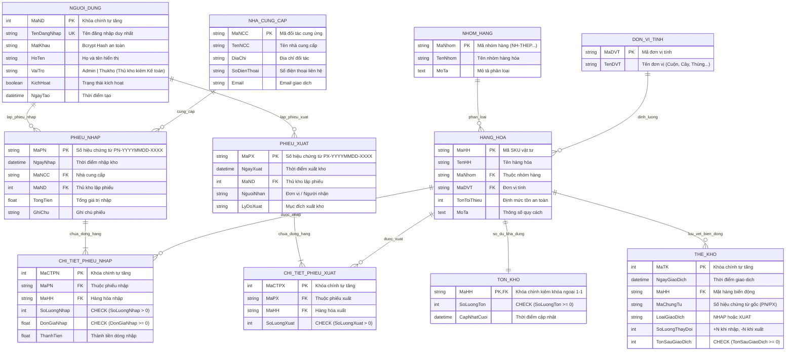

---

## 11. Sơ đồ Hoạt Động (Activity) Xuất Kho Chống Tồn Âm (Hình 4.4.1)

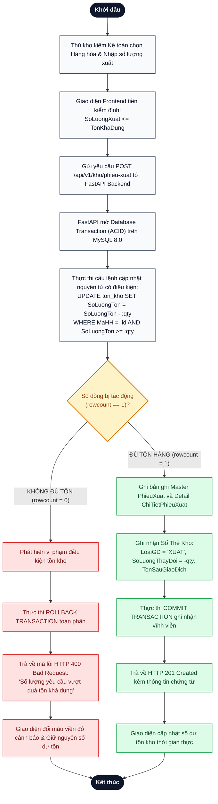

---

## 12. Sơ đồ Hoạt Động (Activity) Trợ Lý AI & Data Sanitizer (Hình 4.4.2)

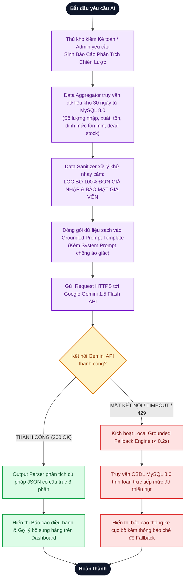

---

## 13. Sơ đồ Lớp (Class Diagram) Backend FastAPI & Domain Services (Hình 4.5.1)

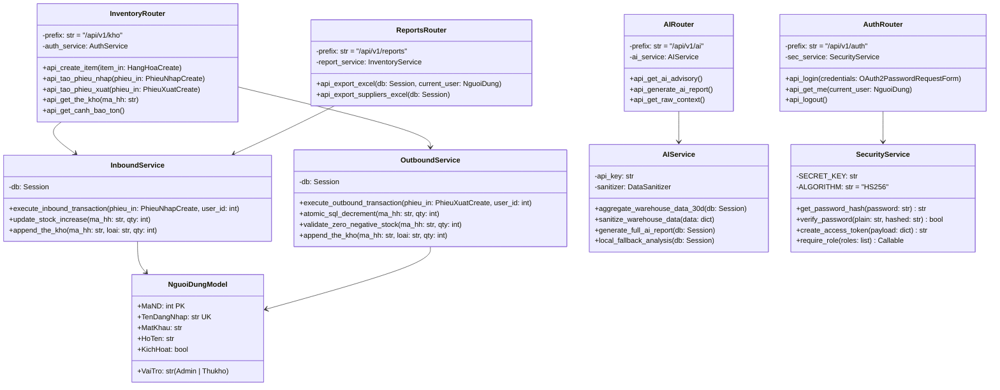

---

## 14. Sơ đồ Kiến Trúc Phân Hệ Chức Năng (Hình 2.2.3)

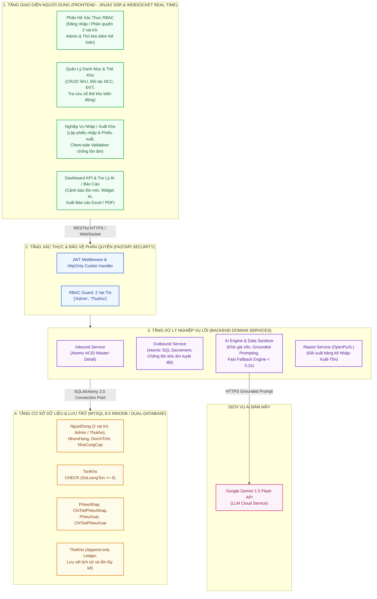
